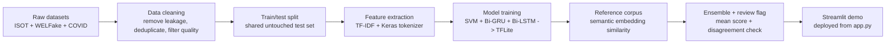

# Pipeline

This project follows a single, reproducible path from raw data to deployed demo.

## Main stages

1. **Dataset fusion**
   - ISOT for the historical baseline.
   - WELFake for broader styles and topics.
   - COVID claims to reduce temporal blindness.

2. **Bias control**
   - Remove source leakage such as Reuters datelines.
   - Filter very short, very long, and overly sensational texts.
   - Deduplicate before training.

3. **Modeling**
   - TF-IDF + calibrated LinearSVC as the transparent baseline.
   - Bi-GRU and Bi-LSTM as lightweight neural models, exported to TFLite so
     the deployed app runs them via the ~10 MB `ai-edge-litert` interpreter
     instead of the full TensorFlow runtime.
   - Simple ensemble average with a disagreement check.
   - `experiments/` documents a tested alternative (sentence-embedding
     classifier) that was measured and rejected — see the README.

4. **Reference corpus retrieval**
   - Semantic similarity (sentence embeddings, `all-MiniLM-L6-v2`) against
     snippets already known to be real or fake — matches reworded claims,
     not just literal ones.
   - The model weights are committed under `models/embedding_model/` (not
     downloaded from the Hugging Face Hub at runtime), so this layer never
     depends on network access at cold start.
   - Treated as a support signal, not as fact-checking.
   - The demo surfaces the retrieved evidence directly.

5. **Claim-level retrieval**
   - Split the input into claim-like sentences.
   - Retrieve evidence independently for each claim.
   - Surface supported, refuted, and unsupported claims in the UI.

6. **Live retrieval fallback**
   - Query a free external source (Google Fact Check API when a key is available, otherwise GDELT).
   - Live lookups are capped to the first few claims and rate-limited (GDELT allows ~1 request / 5 s).
   - A live fact-check verdict takes precedence for a claim; the committed corpus decides otherwise.
   - The adversarial benchmark runs with live retrieval disabled so its numbers stay reproducible offline.

7. **Deployment**
   - `app.py` is the Streamlit entry point.
   - `requirements.txt` and `.streamlit/config.toml` make the app deployable on Streamlit Community Cloud.
   - In the Streamlit Cloud app settings, select Python 3.11.
   - The deployed app never imports TensorFlow (only used for training, via
     `requirements-train.txt`) — see the README for why that keeps the whole
     system, RNNs and embeddings included, under ~600 MB peak memory.
   - Live app: https://fake-news-screening.streamlit.app/

## Figures

The main bias-analysis figures are stored in `reports/figures/` and are indexed
from [reports/README.md](reports/README.md):

- [Reuters leakage](reports/figures/reuters_leakage.png)
- [Style leakage](reports/figures/style_leakage.png)
- [Temporal window](reports/figures/temporal_window.png)

These charts explain why the final system is structured around bias control,
multi-dataset fusion, and retrieval plus human review rather than raw accuracy.
