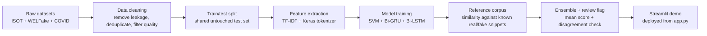

# Pipeline

This project follows a single, reproducible path from raw data to deployed demo.

## Main stages

1. **Dataset fusion**
   - ISOT for the historical baseline.
   - WELFake for broader styles and topics.
   - COVID claims to reduce temporal blindness.

2. **Bias control**
   - Remove source leakage such as Reuters datelines.
   - Filter very short, very long, and overly sensational texts.
   - Deduplicate before training.

3. **Modeling**
   - TF-IDF + calibrated LinearSVC as the transparent baseline.
   - Bi-GRU and Bi-LSTM as lightweight neural models.
   - Simple ensemble average with a disagreement check.

4. **Reference corpus heuristic**
   - Retrieval against snippets already known to be real or fake.
   - Treated as a support signal, not as fact-checking.
   - The demo surfaces the retrieved evidence directly.

5. **Claim-level retrieval**
   - Split the input into claim-like sentences.
   - Retrieve evidence independently for each claim.
   - Surface supported, refuted, and unsupported claims in the UI.

6. **Live retrieval fallback**
   - Query a free external source first (Google Fact Check API when a key is available, otherwise GDELT).
   - Fall back to the committed corpus when live evidence is weak or missing.
   - Keep the system free by default.

7. **Deployment**
   - `app.py` is the Streamlit entry point.
   - `requirements.txt` and `.streamlit/config.toml` make the app deployable on Streamlit Community Cloud.
   - In the Streamlit Cloud app settings, select Python 3.11 so TensorFlow 2.15 can install correctly.

## Figures

The main bias-analysis figures are stored in `reports/figures/` and are indexed
from [reports/README.md](reports/README.md):

- [Reuters leakage](reports/figures/reuters_leakage.png)
- [Style leakage](reports/figures/style_leakage.png)
- [Temporal window](reports/figures/temporal_window.png)

These charts explain why the final system is structured around bias control,
multi-dataset fusion, and retrieval plus human review rather than raw accuracy.
