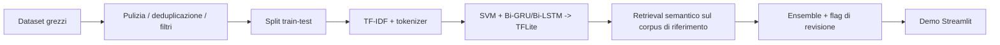

# Fake News Screening (HDSS)

[English](README.md) | **Italiano**

Un sistema ibrido di screening della disinformazione: una SVM calibrata, una
Bi-GRU e una Bi-LSTM votano su testi di notizie in inglese, supportate da una
ricerca per similarità *semantica* sui corpora di addestramento e da un flag
di revisione umana quando i modelli sono in disaccordo.
Nato come progetto universitario di IA, qui è stato ricostruito come una
pipeline pulita e riproducibile: **analisi del dataset → modelli → demo
Streamlit**.

Demo live: https://fake-news-screening.streamlit.app/

> **Il dato onesto:** l'ensemble ottiene **94,6%** su un test set in-domain
> senza leakage e **76,2%** su 101 scenari adversarial fuori dominio, che
> spaziano tra claim brevi e articoli lunghi, sei domini tematici e due *stili*
> di disinformazione. Contro la disinformazione classica in stile umano
> (deals segreti, memo trapelati, whistleblower) tiene **zero falsi
> negativi** — nessuna bufala di questo tipo passa mai. Contro un testo
> fluente e attribuito a una fonte senza quei tropi, testato su 43 vere
> uscite ChatGPT-3.5 su disinformazione documentata (non scritte da questo
> progetto — vedi sotto il perché conta, e quanti candidati grezzi sono
> stati scartati dopo revisione manuale prima di arrivare a quel numero), il
> recall è al **74%** — un divario reale e moderato che si è mosso man mano
> che il campione cresceva (83% a n=6, 61% a n=18, 74% a n=43): si è
> allargato, poi si è ristretto, ed è proprio questo il dato onesto, non un
> singolo numero della sequenza. Vedi *"La disinformazione generata
> dall'IA è più difficile da individuare"* più sotto. Il layer di retrieval
> serve a *trovare* i claim veri/falsi noti più simili, non ad affermare la
> verità partendo da una vicinanza tematica — vedi *"Due usi molto diversi
> degli embeddings"* per capire perché questa distinzione conta e quanto costa.

## Motivazione e contesto di ricerca

Questo strumento nasce da uno studio sulla **sicurezza cognitiva** — la
protezione del giudizio umano dalla manipolazione intenzionale. La premessa è
che la frontiera della sicurezza si è spostata: le moderne operazioni ibride
mirano sempre più a *come le persone decidono*, non alle macchine che usano,
per cui la classica triade CIA (riservatezza, integrità, disponibilità) non
copre più l'intera superficie d'attacco. L'IA generativa acuisce l'asimmetria:
un attore ostile può oggi fabbricare migliaia di varianti persuasive e
linguisticamente native di una notizia falsa a costo marginale quasi nullo,
mentre la verifica resta lenta e costosa.

Due idee di quel lavoro plasmano direttamente il progetto:

- **"Fake news" è l'unità di analisi sbagliata.** Il framework *Information
  Disorder* di Wardle & Derakhshan (Consiglio d'Europa, 2017) distingue
  *misinformation* (falso, condiviso senza intento di nuocere), *disinformation*
  (falso, deliberatamente dannoso) e *malinformation* (contenuto vero usato
  come arma). Un classificatore di testo può toccare solo il segnale di
  falsità-del-contenuto dei primi due — è cieco all'intento, e
  strutturalmente cieco alla malinformation, dove il contenuto è vero. Il
  limite onesto di un sistema così è quindi **screening, non verdetto**:
  vive dentro un processo umano, non al suo posto.
- **Non puoi difendere ciò che non hai testato.** Lo stesso motivo per cui i
  team di sicurezza conducono esercizi adversarial è il motivo per cui gli
  scenari fuori dominio restano nel repo come stress test permanente e
  ripetibile (vedi il benchmark più sotto), non come numero una-tantum — e per
  cui i layer aggiunti sopra il classificatore tendono all'*inoculazione*
  (mostrare le tecniche di manipolazione con cui il lettore viene bersagliato)
  piuttosto che a un mero timbro vero/falso. Lo stesso benchmark è anche dove
  la domanda di ricerca trova una risposta misurabile, per quanto scomoda:
  vedi *"La disinformazione generata dall'IA è più difficile da individuare"*
  più sotto.

La domanda di ricerca originaria era, in sintesi: *cosa può e cosa non può
essere automatizzato nella difesa dello spazio informativo, e dove l'umano deve
restare nel loop?* Questo repository è la metà applicata e misurabile di quella
risposta — un sistema funzionante costruito per essere onesto sui propri limiti.

## Il problema del "99% di accuratezza"

I primi esperimenti sul corpus ISOT portavano *ogni* architettura oltre il
98% di accuratezza. Il notebook
[`notebooks/01_dataset_bias_analysis.ipynb`](notebooks/01_dataset_bias_analysis.ipynb)
documenta perché quei numeri sono un campanello d'allarme, non un risultato:

| Bias nei dati | Effetto |
|---|---|
| **Leakage stilistico** — gli articoli fake hanno in media 2,16 `!`/`?` per articolo e il 30% di maiuscole nei titoli, quelli veri 0,17 e 6% | i modelli imparano la punteggiatura, non il contenuto |
| **Leakage di fonte** — il 99,2% degli articoli "veri" contiene la dicitura `(Reuters)`, lo 0,0% di quelli falsi | l'etichetta è letteralmente scritta nel testo |
| **Cecità temporale** — solo politica USA 2015–2017, con volumi di veri/falsi disallineati nel tempo | tutto ciò che è successivo al 2018 (COVID, elezioni) è fuori dominio |

<p align="center">
  
  
</p>
<p align="center">
  
</p>

## Cosa fa il sistema per contrastarlo

1. **Fusione multi-dataset** — ISOT + WELFake (filtrato per qualità: lunghezza,
   rapporto di maiuscole, punteggiatura) + claim COVID-19, deduplicati: 53.661
   articoli unici.
2. **Protocollo di split rigoroso** — split train/test *prima* di qualunque
   oversampling; la quota COVID è bilanciata e potenziata ×3 solo sul lato
   training; tutti i modelli condividono lo stesso test set intatto (10.733
   articoli). Correggere solo questo protocollo ha spostato la SVM da un
   dichiarato ~98% a un reale 95,3%.
3. **Ensemble di modelli economici e trasparenti** — baseline TF-IDF +
   LinearSVC calibrata, più due RNN bidirezionali leggere (~1,3 MB ciascuna),
   servite come modelli TFLite tramite l'interprete `ai-edge-litert` (~10 MB)
   invece del runtime TensorFlow completo; il punteggio finale è la media
   semplice.
4. **Livello di retrieval di riferimento** — similarità di embeddings di
   frase ([`all-MiniLM-L6-v2`](https://huggingface.co/sentence-transformers/all-MiniLM-L6-v2))
   rispetto a snippet dei ~68k articoli noti come veri/falsi: riconosce un
   claim *riformulato*, non solo letterale. Questo è *retrieval su ciò che
   il sistema ha già visto*, *non* fact-checking, e la demo mostra
   esplicitamente le evidenze recuperate.
5. **Retrieval a livello di claim** — l'input è diviso in frasi simili a
   affermazioni verificabili, e ogni claim viene recuperato in modo
   indipendente, così l'interfaccia può mostrare, per ciascun claim, se
   corrisponde a un'affermazione falsa nota, a un articolo reale noto, o se
   non ha corrispondenze — etichette di *evidenza*, non giudizi di verità.
6. **Retrieval live** — i primi claim vengono controllati anche su fonti live
   gratuite, in ordine di precedenza: Google Fact Check Tools (un vero
   *verdetto* di fact-checking, quando è configurata una chiave API), poi
   Wikipedia (contesto affidabile e senza chiave), con GDELT come ricerca
   notizie di ultima istanza. Un verdetto di fact-checking live ha la
   precedenza per quel claim; altrimenti decide il corpus committato, così il
   sistema funziona anche completamente offline.
7. **Flag di revisione umana** — quando i tre modelli sono in forte
   disaccordo (scarto > 0,40), il verdetto viene segnalato come a bassa
   affidabilità invece di essere presentato come certo.

## Livelli di affidabilità e prebunking

Quattro livelli si aggiungono sopra il classificatore per renderlo utilizzabile
come vero strumento di screening e non una demo — ciascuno scelto per attaccare
una debolezza misurata dei modelli base (vedi il benchmark adversarial: ogni
errore è un falso positivo sicuro su un claim breve *vero*).

8. **Fact-check live come verdetto di prima classe** — il rating di Google Fact
   Check (il verdetto di un fact-checker professionale) ora *domina* l'ensemble
   nel risultato principale, non è più solo un pannello a lato. È l'unico
   segnale insieme autorevole e *attuale*, quindi è ciò che permette allo
   strumento di aver ragione su eventi che i dati di training 2015–2020 non
   hanno mai visto. ([`src/predict.py`](src/predict.py))
9. **Livelli di confidenza, non falsa certezza** — ogni risultato porta un
   livello di `confidence` e un flag `evidence_backed`. Un verdetto solo-modello
   su un claim breve fuori dominio (esattamente dove i modelli sbagliano con
   sicurezza) è presentato come **segnale di screening a bassa confidenza da
   verificare**, mai come verità acquisita. Questo abbassa solo la confidenza —
   non ribalta *mai* FAKE→REAL, quindi la garanzia zero-falsi-negativi resta.
10. **Rilevamento delle tecniche di manipolazione (prebunking / inoculazione)**
    — un livello robusto a dominio e tempo che segnala *come* un testo cerca di
    persuadere (appello alla conoscenza nascosta, fonte non verificabile,
    autorità fabbricata, linguaggio della paura, falsa certezza, urgenza,
    noi-contro-loro), ognuna con una breve spiegazione. Seguendo Roozenbeek &
    van der Linden (2019), nominare la tecnica inocula il lettore meglio di un
    timbro vero/falso. È ortogonale al classificatore — sul benchmark si accende
    su 17 delle 23 bufale in stile classico ma su nessuna delle affermazioni
    vere che i modelli sovra-segnalano — e alza il flag di revisione senza mai
    cambiare il label. Condivide però gran parte del punto cieco del
    classificatore sulle bufale fluenti in stile IA (20 su 43 reali segnalate,
    3 su 8 scritte a mano): vedi sotto. ([`src/manipulation.py`](src/manipulation.py))
11. **Explainability e un feedback loop chiuso davvero** — la SVM è
    lineare, quindi il suo punteggio si scompone esattamente in contributi
    per-token (TF-IDF × coefficiente); la demo mostra le parole che spingono
    verso FAKE e verso REAL. Un form 👍/👎 + etichetta-corretta registra le
    correzioni in un file JSONL locale, e `python -m src.incorporate_feedback`
    incorpora le correzioni verificate (l'utente ha dissentito *e* fornito
    l'etichetta giusta) direttamente nel corpus di retrieval — lo stesso
    corpus su cui SVM/RNN non vengono riaddestrati, ma che il layer di
    retrieval interroga a ogni previsione, quindi una correzione torna
    subito recuperabile come evidenza, senza un ciclo completo di
    riaddestramento. Idempotente: ogni correzione viene marcata una volta
    incorporata, così rieseguire lo script processa solo ciò che è nuovo.
    ([`src/explain.py`](src/explain.py), [`src/feedback.py`](src/feedback.py),
    [`src/incorporate_feedback.py`](src/incorporate_feedback.py))

Il benchmark fuori dominio resta offline e riproducibile (nessuna chiamata
live), così questi livelli migliorano il comportamento reale senza gonfiare
il 76,2% misurato. Un test di regressione
([`tests/test_benchmark_invariants.py`](tests/test_benchmark_invariants.py))
verifica la garanzia che regge davvero — **zero falsi negativi sulla
disinformazione in stile classico** — e una soglia minima di accuratezza
complessiva, senza fingere che il divario sullo stile IA-fluente qui sotto non
esista.

## La disinformazione generata dall'IA è più difficile da individuare

Questa è una risposta diretta e parziale alla domanda di ricerca dietro questo
progetto (vedi *Motivazione* sopra): **rimuovere gli indicatori stilistici
della disinformazione toglie anche a chi si difende la capacità di
riconoscerla?** La sezione documenta anche una correzione metodologica fatta a
metà progetto — il risultato è diventato più debole, e più affidabile, dopo
aver corretto un difetto in come era stato misurato la prima volta.

Il benchmark a 101 scenari etichetta ogni claim fabbricato con uno `style`:

- **`human_typical`** (23 scenari) — i tropi classici della disinformazione:
  *accordi segreti*, *un memo trapelato*, *secondo un whistleblower*, *fonti
  anonime*. È il registro di cui sono pieni i corpora di addestramento
  (ISOT/WELFake, in gran parte scritti da umani, pre-2021).
- **`ai_fluent`** (51 scenari) — lo stesso tipo di claim fabbricato, scritto
  come prosa fluente, calma, attribuita a una fonte, senza nessuno di quei
  tropi: un'istituzione dal nome plausibile, una statistica specifica, una
  cautela metodologica — il registro che un LLM moderno produce di default
  quando gli si chiede di scrivere testo persuasivo (vedi Goldstein et al.,
  2023; Helmus & Chandra, 2024, citati in *Motivazione*).

**Perché `ai_fluent` è diviso per `provenance`, e perché questo conta più del
numero in testa.** La prima versione di questo benchmark aveva tutti gli
scenari `ai_fluent` scritti a mano per questo progetto — da un LLM, che
conosceva esattamente cosa cerca il detector di tecniche di manipolazione di
questo stesso sistema. Questo è circolare: misura se una difesa può essere
elusa da qualcuno che già sa come funziona, non se la disinformazione
*effettivamente prodotta* da un LLM la elude. Per correggere questo, gli
scenari lunghi scritti a mano sono stati sostituiti con vera disinformazione
generata da ChatGPT-3.5, pescata (seed casuale fisso, stratificato per
dominio e metodo di generazione, nessuna selezione mirata *sul risultato*)
dal **dataset LLMFake** di Chen & Shu
([ICLR 2024](https://github.com/llm-misinformation/llm-misinformation), il
cui stesso risultato è che "la disinformazione generata da LLM può essere più
difficile da individuare per umani e detector rispetto alla disinformazione
scritta da umani con la stessa semantica"). Prima di usarlo, il suo
sotto-corpus CoAID è stato controllato e scartato: un controllo di
sovrapposizione testuale ha trovato che filtra nei nostri stessi dati di
training COVID-19, il che lo avrebbe reso un test di leakage, non un test
adversarial.

Questo campione `external_dataset` è cresciuto tre volte — 6, poi 18, ora
**43** scenari — aggiungendo ogni volta metodi di generazione, non solo
volume: parafrasi e riscrittura di disinformazione reale (i due originali),
generazione open-ended, sei sotto-strategie `information_manipulation` che
distorcono articoli PolitiFact realmente **veri** trasformandoli in
disinformazione, e un piccolo gruppo
`hallucination`/`partially_arbitrary_generation` fabbricato da un prompt
senza nessun articolo seed (quest'ultimo gruppo ha anche aggiunto un dominio
`science` al campione esterno). Ogni candidato che superava i filtri
automatici (il testo generato differisce dall'originale, rispetta un limite
di lunghezza) è stato poi **letto individualmente prima dell'inclusione** —
questo ha scartato circa metà dei candidati: trascrizioni storiche reali (un
discorso di Obama del 2008 riportato alla lettera), affermazioni vere che
per puro caso differivano testualmente dall'originale, testo di
debunking/correzione, e un paio di rifiuti espliciti del modello. Nessuno di
questi conta nei 43; solo i claim che affermano davvero qualcosa di falso
sono stati inclusi. Gli 8 scenari `ai_fluent` brevi restano scritti a mano
per un motivo che oggi non vale più per la crescita futura ma non valeva per
questo passaggio: non esisteva un corpus di disinformazione breve generata
da LLM finché `information_manipulation` non è stato identificato a metà
progetto (vedi sotto) — restano nel benchmark come dato esplorativo
dichiarato, non come titolo.

Recall misurato (il "tasso di cattura" delle bufale),
`python -m src.evaluate --adversarial`:

| Stile / provenienza | n | Recall (tasso di cattura) | Layer di manipolazione segnala |
|---|---|---|---|
| `human_typical` (scritto a mano) | 23 | **100%** (0 mancate) | 3/23 (13%) |
| `ai_fluent` / **`external_dataset`** (reale, non scritto da questo progetto) | 43 | **74,4%** (32/43) | 20/43 (47%) |
| `ai_fluent` / `hand_authored` (esplorativo, con la riserva di circolarità sopra) | 8 | 50,0% (4 mancate) | 3/8 (38%) |

All'interno di `external_dataset`, il recall si scompone ulteriormente per
**come** ChatGPT-3.5 ha prodotto la disinformazione. Solo i due gruppi
presenti già a n=18 sono abbastanza grandi (n=12, n=6) da leggersi come
qualcosa di più del rumore; tutto ciò che è stato aggiunto a n=43 ha n≤10 ed
è tracciato, non ancora affidabile singolarmente:

| Metodo di generazione | n | Recall (tasso di cattura) |
|---|---|---|
| Parafrasi della bufala originale | 12 | **75,0%** |
| Riscrittura completa della bufala originale | 6 | **33,3%** |
| Generazione open-ended (stessi articoli seed) | 10 | 90,0% |
| `information_manipulation` (6 sotto-strategie, aggregate) | 12 | 75,0% |
| `hallucination` / `partially_arbitrary_generation` (senza articolo seed) | 4 | 75,0% |

Una riscrittura lascia ancora al modello molta più libertà di ristrutturare
il testo di quanta ne dia una parafrasi, e quel divario specifico (75,0%
contro 33,3%) è l'unico asse di questa tabella abbastanza vecchio da
fidarsene. I nuovi gruppi sono direzionalmente interessanti —
`information_manipulation`, che distorce articoli realmente veri invece di
riformulare bufale già esistenti, ha ottenuto un recall alto quanto la
parafrasi — ma ciascuno è ancora troppo piccolo per generalizzare.

**Il risultato citabile è la riga centrale della prima tabella.**
`human_typical` ottiene 100% (23/23) contro `ai_fluent`/`external_dataset`
al 74,4% (32/43) — un divario reale, non circolare, di circa 26 punti. La
riga in basso è un'evidenza più debole: direzionalmente coerente, ma la
costruzione a mano non può escludere di essere stata implicitamente
calibrata contro la logica di rilevamento di questo stesso sistema.

**Un risultato che si è allargato, poi ristretto, man mano che il campione
cresceva — ed è proprio questo il punto.** Il recall su `external_dataset`
misurava 83,3% a n=6, 61,1% a n=18, e ora 74,4% a n=43. Letti tutti e tre
insieme invece di sceglierne uno: il recall su un singolo sottogruppo
piccolo è rumoroso — il campione a n=6 era un'estrazione più facile del
tipico, quello a n=18 (ancora solo due metodi di generazione) era più
difficile del tipico, e n=43 si colloca tra i due con più metodi di
generazione rappresentati. I due sottogruppi abbastanza vecchi da essere
stati misurati sia a n=18 sia a n=43 (parafrasi, riscrittura) non si sono
mossi affatto (75,0% / 33,3%, invariati) — il che è di per sé informativo:
ciò che si è mosso è la *composizione* del campione, non il comportamento
di fondo di quei due metodi. Questo è dichiarato qui invece di essere
compresso nell'ultima cifra, perché chi deve decidere quanto fidarsi di
questo benchmark ha bisogno di vedere che si è spostato due volte, non solo
dove è atterrato l'ultima volta.

**Una ritrattazione, nell'interesse della stessa onestà che questo README
chiede al sistema.** Una versione precedente di questa sezione affermava
anche una "seconda conferma indipendente" dell'effetto tramite la lunghezza
dell'input: a n=6, sostituire ogni scenario lungo scritto a mano con dati
reali esterni aveva fatto passare l'accuratezza sugli scenari lunghi dal
56,2% (peggiore dei brevi) all'87,5% (migliore dei brevi), letto come prova
che il presunto "effetto lunghezza" originale fosse puramente un artefatto
della scrittura a mano avversariale. Nemmeno quella lettura ha retto: a n=18
si era già calmata a una quasi-parità (71,4% contro 75,0%), e a n=43 — ora
con veri scenari brevi in `external_dataset` per la prima volta, non solo
scritti a mano — il recall sui FAKE per lunghezza è **75,0% sui lunghi
contro 84,2% sui brevi**, ancora nessun segno che la lunghezza sia un
fattore indipendente di rilevabilità in nessuna delle due direzioni. La
lezione non è solo "la prima misurazione era circolare" ma "anche una
correzione successiva misurata su n=6 resta un campione piccolo" — sia
l'errore originale di questo progetto sia la sua prima correzione erano più
sicuri di quanto i dati disponibili in quel momento giustificassero davvero.

**Cosa significa, e cosa non significa, per le garanzie del sistema.** La
garanzia di zero falsi negativi ripetuta in tutto questo README è reale, ma
ora è esplicitamente delimitata: regge per la disinformazione scritta nel modo
in cui è stata storicamente scritta la disinformazione documentata. Contro la
fabbricazione fluente generata da IA regge decisamente meno bene — un
divario reale e moderato (100% contro 74,4% su dati sorgente indipendenti)
— ma la dimensione esatta di quel divario si è già spostata due volte con
il campione, quindi va letta come "sostanziale e reale", non come un numero
preciso e stabile. Coerentemente con la sezione *Motivazione* sopra, questo
non è un fallimento del design del sistema ma la sua conferma: uno
**strumento di screening dentro un processo umano**, non un arbitro
automatico. Il passo onesto successivo — non ancora implementato — sarebbe
far crescere oltre n=10 ciascuno i gruppi per metodo di generazione ancora
piccoli (`information_manipulation`, `open_ended_generation`,
`hallucination`) e, separatamente, indagare perché il testo riscritto elude
il rilevamento più di quello parafrasato.

## Pipeline e figure

La pipeline completa è documentata in [PIPELINE.md](PIPELINE.md). Mostra il
flusso end-to-end dai dataset grezzi al deploy su Streamlit.

Il livello di reporting è riassunto in [reports/README.md](reports/README.md),
che spiega cosa dimostra ciascun grafico qui sopra e perché è rilevante per il
sistema finale. Nel complesso, le tre figure documentano i modi di fallimento
che hanno spinto il progetto finale ad allontanarsi da un benchmark guidato
dalla sola accuratezza, verso un workflow di retrieval e revisione.

## Riepilogo della pipeline



## Risultati (tutti misurati, tutti riproducibili)

**In-domain** — test set condiviso, `python -m src.train` →
[`models/metrics.json`](models/metrics.json):

| Modello | Accuratezza | Precisione (fake) | Recall (fake) | F1 (fake) |
|---|---|---|---|---|
| SVM (TF-IDF, calibrata) | 95,3% | 94,8% | 94,9% | 94,8% |
| Bi-GRU | 92,9% | 93,0% | 91,0% | 92,0% |
| Bi-LSTM | 92,9% | 94,1% | 89,9% | 92,0% |
| **Ensemble (media)** | **94,6%** | 94,5% | 93,3% | 93,9% |

**Fuori dominio** — 101 scenari adversarial (hoax plausibili, verità scomode —
claim brevi e articoli lunghi, sei domini, due stili di disinformazione),
`python -m src.evaluate --adversarial` →
[`benchmarks/adversarial_results.json`](benchmarks/adversarial_results.json):

| Dominio | Accuratezza | Falsi positivi | Falsi negativi | Segnalati per revisione |
|---|---|---|---|---|
| Politica | 77,5% | 3 | 6 | 14 |
| COVID | 84,6% | 1 | 1 | 4 |
| Misto | 73,1% | 3 | 4 | 12 |
| Economia | 71,4% | 1 | 1 | 3 |
| Scienza | 66,7% | 0 | 3 | 3 |
| Tecnologia | 83,3% | 1 | 0 | 2 |
| **Totale** | **76,2%** | 9 | 15 | 38 |

Per **lunghezza** — claim brevi vs. scenari lunghi in formato articolo
(recall sugli item FAKE, non accuratezza complessiva — vedi la ritrattazione
sotto per il perché è questo il numero che conta qui):

| Lunghezza | n | Recall FAKE (tasso di cattura) |
|---|---|---|
| Breve | 59 | 84,2% |
| Lunga | 42 | 75,0% |

*(Questa tabella si è spostata tre volte. A n=16 scenari lunghi, tutti
scritti a mano, i lunghi ottenevano un'accuratezza molto peggiore (56,2%) —
letta all'epoca come una seconda conferma indipendente dell'effetto della
fluenza IA. Sostituire quei 6 con dati reali esterni l'aveva ribaltata
all'87,5% — i lunghi ora *migliori* dei brevi — il che mostrava che la
prima lettura era un artefatto della scrittura a mano, non una proprietà
della lunghezza. A n=28 scenari lunghi si era assestata quasi alla parità
(71,4% contro 75,0%). Ora, a n=42 lunghi / 59 brevi — con veri scenari
brevi in `external_dataset` per la prima volta, non solo scritti a mano —
si legge **75,0% sui lunghi contro 84,2% sui brevi**: ancora nessun segno
che la lunghezza sia un fattore indipendente di rilevabilità. Vedi la
ritrattazione nella sezione *"La disinformazione generata dall'IA è più
difficile da individuare"* sopra per cosa ha insegnato davvero ciascuna
oscillazione.)*

Per **stile**, solo scenari FAKE — il recall (tasso di cattura delle bufale)
che conta di più per uno strumento anti-disinformazione:

| Stile | n | Recall (tasso di cattura) |
|---|---|---|
| `human_typical` (tropi classici) | 23 | **100,0%** |
| `ai_fluent` (stile IA, fluente — media aggregata, vedi sopra) | 51 | 70,6% |

`ai_fluent` mescola due provenienze con un peso probatorio molto diverso —
vedi *"La disinformazione generata dall'IA è più difficile da individuare"*
sopra per la scomposizione citabile e non circolare (74,4% sui dati reali
esterni, n=43, contro 50,0% sul testo scritto a mano, n=8) e per l'ulteriore
scomposizione per metodo di generazione (parafrasi 75,0% contro riscrittura
33,3%, più i gruppi più nuovi e più piccoli).

I falsi positivi ripetono il risultato originale — un **falso positivo su
un'affermazione vera** ("Donald Trump ha vinto le elezioni del 2016…" →
FAKE): la finestra di addestramento 2015–2017 ha insegnato ai classificatori
che brevi affermazioni fattuali sulla politica USA *assomigliano* a esche da
fake news, e il layer di retrieval deliberatamente non le "salva" più
trattando un articolo reale sullo stesso tema come una prova (vedi la sezione
successiva). Ogni falso negativo è una bufala in stile `ai_fluent` — la
garanzia zero-falsi-negativi regge **solo** per la disinformazione in stile
classico, non per la fabbricazione fluente in stile IA (vedi sopra per
quantificare esattamente quanto non regge).

## Cosa dicono i grafici

I grafici del report rispondono a tre domande prima ancora di guardare
l'accuratezza:

1. Il dataset lascia trapelare l'etichetta attraverso lo stile?
2. L'etichetta trapela attraverso marcatori di fonte?
3. La finestra temporale è troppo stretta per generalizzare?

Se anche solo una di queste risposte è "sì", le metriche del modello vanno
lette come stime valide solo in-domain. Per questo il portfolio mette in
primo piano il benchmark adversarial e la pipeline di retrieval/revisione,
invece del solo numero di accuratezza.

## Due usi molto diversi degli embeddings

TF-IDF, una SVM lineare e due piccole RNN sembrano datati rispetto ai
classificatori testuali attuali — perciò entrambi gli usi possibili degli
embeddings transformer sono stati testati su questo progetto, con risultati
opposti e ugualmente istruttivi.

**Classificazione: testata, respinta.** `experiments/` sostituisce la
baseline TF-IDF con embeddings di frase
([`all-MiniLM-L6-v2`](https://huggingface.co/sentence-transformers/all-MiniLM-L6-v2))
più un classificatore lineare calibrato, addestrato e valutato sullo
*stesso identico* dataset fuso e split di `src.train`
(`experiments/embeddings_baseline.py`, `experiments/embeddings_adversarial.py`).

| | In-domain | Fuori dominio (benchmark a 30 scenari) |
|---|---|---|
| Ensemble attuale (TF-IDF + SVM/GRU/LSTM) | 94,6% | 80,0% |
| Embeddings MiniLM + classificatore lineare | 88,5% | 60% |

*Fotografia storica, congelata per comparabilità: misurata sul benchmark
originale a 30 scenari, prima che fosse espanso (prima a 64, poi 76, ora 101,
aggiungendo nuovi domini, articoli lunghi e la suddivisione di stile
human-typical/ai-fluent — vedi "La disinformazione generata dall'IA è più
difficile da individuare"
sopra). Questa ablation era un confronto una-tantum tra approcci di
classificazione, non un benchmark mantenuto, quindi non è stata rieseguita
sul set espanso.*

Il classificatore basato su embeddings ha perso su entrambi i fronti — il
divario più netto è su WELFake (67,1% contro 86,9%) e sul dominio
adversarial "misto". È la conseguenza misurata del leakage documentato in
[`notebooks/01_dataset_bias_analysis.ipynb`](notebooks/01_dataset_bias_analysis.ipynb):
la distinzione fake/vero in questi corpora è guidata in gran parte da stile
superficiale e marcatori di fonte (punteggiatura, maiuscole, la dicitura
`(Reuters)`), e TF-IDF è costruito apposta per sfruttare esattamente quel
segnale letterale. Un modello di embedding semantico è costruito per
esserne invariante — quindi su questo dataset, capire *meglio* il
significato è uno svantaggio per la classificazione.

**Retrieval: testato, adottato.** Trovare il claim *noto* più vicino è un
compito diverso dalla classificazione, ed è esattamente ciò per cui gli
embeddings semantici sono fatti: far corrispondere "il vaccino COVID altera
il tuo codice genetico" a un claim salvato sul vaccino che "altera
permanentemente il DNA", pur con un vocabolario condiviso quasi nullo —
qualcosa che il vecchio livello di riferimento TF-IDF, basato sulla
sovrapposizione letterale di termini, non poteva fare per costruzione.
`src/rag.py` ora calcola una volta sola gli embeddings dei ~68k snippet del
corpus di riferimento (`REF_EMBEDDINGS_FILE`, committato, ~46 MB) e
confronta le query per similarità coseno. Anche i pesi del modello stesso
(`models/embedding_model/`, ~88 MB) sono committati invece di essere scaricati
da Hugging Face Hub a runtime — i container di Streamlit Cloud ripartono da un
filesystem pulito a ogni redeploy, e questo livello gira su *ogni* previsione,
non solo sul retrieval live, quindi un download da Hub all'avvio a freddo era
un rischio concreto: se la rete ha un intoppo, l'app semplicemente non parte.

**Il segnale di retrieval è volutamente asimmetrico — e l'asimmetria conta
più del numero in cima.** Una versione iniziale lasciava che *qualsiasi*
corrispondenza, vera o falsa, influenzasse il verdetto. Otteneva un 83,3%
adversarial più alto — ma in parte fabbricando verità: un'affermazione falsa
condivide di continuo il proprio argomento con notizie reali ("il vaccino
altera il tuo DNA" sta proprio accanto ad articoli veri sulla genetica del
COVID), quindi la demo mostrava un pannello verde "REAL / SUPPORTED"
*direttamente sotto un verdetto FAKE rosso*, arrivando a dare il via libera a
una teoria complottista sul vaccino. È esattamente il segnale sbagliato per
uno strumento anti-disinformazione. Perciò il layer di riferimento ora è
asimmetrico:

- Corrispondere a un claim **falso** noto è vera evidenza di falsità — alza il
  punteggio già da una similarità modesta, e un match quasi letterale può
  scavalcare l'ensemble.
- Corrispondere a un articolo **vero** noto afferma REAL solo se è *quasi
  letterale* (`REF_OVERRIDE_THRESHOLD = 0,90`); la semplice vicinanza tematica
  è mostrata come evidenza neutra ("lo snippet noto più vicino è reale al
  69%"), mai come un verdetto.

Questo costò all'epoca circa tre punti di accuratezza adversarial (83,3% →
80,0%, misurati sul benchmark originale a 30 scenari; un'affermazione COVID
vera non più "salvata" da un articolo reale sullo stesso tema) — un costo che
vale la pena pagare: i pannelli non possono più contraddire il verdetto, e la
demo non presenta mai un'affermazione falsa come supportata. La similarità di
embeddings semplicemente non separa "stesso claim, riformulato" da "stesso
argomento, claim diverso" con abbastanza nettezza da
essere trattata come segnale di verità, ma solo come evidenza recuperata.

**Perché entrambi sono diventati sostenibili insieme:** le RNN ora girano
come modelli TFLite tramite l'interprete `ai-edge-litert` (~10 MB) invece
del runtime TensorFlow completo (~500+ MB solo per il framework, a
prescindere dalla dimensione del modello). La memoria di picco misurata per
l'intero sistema — SVM, entrambe le RNN, il corpus di riferimento e il
modello di embeddings insieme — è di **~600 MB**, contro un limite di 1 GB
del piano gratuito di Streamlit Cloud. Tenere TensorFlow e PyTorch insieme
non ci sarebbe stato; rinunciare alle RNN o agli embeddings sarebbe stato un
compromesso inutile. L'addestramento avviene ancora con TensorFlow completo
(`requirements-train.txt`); solo l'app deployata doveva cambiare.

## Collocazione nella tassonomia del disordine informativo

"Fake news" è un'etichetta scientificamente inadeguata: il framework
*Information Disorder* di Wardle & Derakhshan (Consiglio d'Europa, 2017)
distingue **misinformation** (falso, condiviso senza intento dannoso),
**disinformation** (falso, intenzionalmente dannoso) e **malinformation**
(contenuto genuino usato per nuocere). Un classificatore testuale può
occuparsi solo del *segnale di falsità del contenuto* delle prime due — è
cieco all'intento, e per costruzione alla malinformation, dove il contenuto è
vero. Questa è una seconda ragione strutturale (oltre all'accuratezza
misurata fuori dominio) per cui il sistema è inquadrato come un **aiuto allo
screening dentro un processo umano**, non un arbitro automatico della verità.

Il benchmark adversarial versionato segue la stessa logica che la
letteratura sulla sicurezza cognitiva applica alle istituzioni — *non puoi
difendere ciò che non hai testato*: i 101 scenari restano nel repository come
uno stress test permanente e ripetibile, non un esperimento occasionale.

## Struttura del repository

```
├── app.py                  Demo Streamlit (solo UI)
├── src/
│   ├── config.py           ogni percorso, iperparametro e soglia
│   ├── data.py             caricamento / filtri / fusione / protocollo di split unificati
│   ├── train.py            addestra SVM + GRU + LSTM, esporta TFLite, scrive metrics.json
│   ├── predict.py          ScreeningSystem: ensemble + euristica + flag di revisione
│   ├── evaluate.py         report in-domain e benchmark adversarial
│   ├── rag.py              retrieval sul corpus di riferimento (embeddings semantici)
│   ├── claim_rag.py        analisi di retrieval per singolo claim
│   ├── external_retrieval.py  evidenza live (Google Fact Check / Wikipedia / GDELT)
│   ├── manipulation.py     livello prebunking: tecniche di manipolazione retorica
│   ├── explain.py          contributi per-token della SVM (spiegazione lineare esatta)
│   ├── feedback.py         log append-only delle correzioni utente (JSONL)
│   ├── incorporate_feedback.py  incorpora le correzioni verificate in reference_corpus/
│   └── tokenizer.py        tokenizer indipendente dal framework (niente TF in produzione)
├── tests/                  suite pytest: protocollo di split, logica ensemble, retrieval,
│                           e app.py stesso via AppTest di Streamlit (vedi sotto)
├── models/                 artefatti addestrati incl. RNN TFLite (~8 MB) e il
│                           modello di embedding committato (~88 MB)
├── reference_corpus/       snippet noti veri/falsi + embeddings (~55 MB)
├── benchmarks/             scenari versionati + risultati misurati
├── experiments/            alternative testate e scartate (vedi sopra)
├── notebooks/              analisi del bias del dataset (il "perché" del design)
├── reports/figures/        grafici esportati
└── data/                   dataset (non committati — vedi data/README.md)
```

## Avvio rapido

```bash
# Python 3.10 o 3.11
pip install -r requirements.txt

# Avvia la demo con i modelli già committati
streamlit run app.py

# Riproduci tutto da zero — servono i dataset (vedi data/README.md)
# E TensorFlow, usato solo per l'addestramento; l'app in sé non ne ha bisogno:
pip install -r requirements-train.txt
python -m src.train                  # ~10 min su CPU
python -m src.evaluate               # tabella metriche in-domain
python -m src.evaluate --adversarial # benchmark fuori dominio

# Esegui la suite di test (protocollo di split, logica ensemble, retrieval,
# e la UI Streamlit stessa via AppTest — nessun browser necessario)
pip install -r requirements-dev.txt
python -m pytest tests/
```

`tests/test_app.py` esegue `app.py` end-to-end tramite il framework ufficiale
[`AppTest`](https://docs.streamlit.io/develop/api-reference/app-testing) di
Streamlit — modelli reali, corpus di retrieval reale, nessun mocking del
percorso di predizione. È esattamente ciò che ha scoperto un bug reale
mentre veniva scritto: il form di feedback viveva interamente dentro `if
st.button("Analyze") and text.strip():`, e `st.button()` è `True` solo
nell'esatto run dello script in cui è stato cliccato. Qualunque interazione
successiva con i widget del form di feedback stesso — incluso cliccare il suo
stesso pulsante "Submit feedback" — innescava un rerun in cui
`st.button("Analyze")` tornava `False`, quindi l'intero pannello del
risultato (e il form al suo interno) spariva *prima* che la correzione
venisse mai registrata. Confermato con un browser reale, non solo con
AppTest, poi corretto conservando il risultato in `st.session_state` così
sopravvive ai rerun innescati da altri widget.
`test_feedback_submission_keeps_the_result_visible_and_is_recorded` in
`tests/test_app.py` è il test di regressione per questo bug.

## Deploy su Streamlit Cloud

Questo repository è già configurato per un deploy standard su Streamlit
Cloud.

Puoi aprire l'app già deployata direttamente su
https://fake-news-screening.streamlit.app/.

1. Collega il repository GitHub `lauratonsi/Fake_News_Screening`.
2. Usa `app.py` come entry point.
3. Mantieni `main` come branch predefinito.
4. Lascia che Streamlit installi le dipendenze da `requirements.txt` (include
   un indice PyTorch CPU-only per `torch`, così non scarica una build CUDA
   da svariati GB).
5. In **Advanced settings**, imposta la versione di Python a **3.11**.
6. I default di tema/server sono impostati in `.streamlit/config.toml`.

Se il deploy va a buon fine, la demo dovrebbe caricare i modelli già
committati in `models/` e `reference_corpus/` e funzionare senza bisogno di
riaddestramento né di TensorFlow — vedi *"Perché entrambi sono diventati
sostenibili insieme"* sopra per il conto della memoria dietro questa scelta.

## Retrieval live: configurazione e aspettative oneste

Il livello live (`src/external_retrieval.py`) interroga fonti gratuite per
ogni claim, in ordine di precedenza:

1. **Google Fact Check Tools** — solo se è impostata
   `GOOGLE_FACTCHECK_API_KEY`. L'unica fonte che restituisce un vero
   *verdetto* di fact-checking, quindi vince.
2. **Wikipedia** (API di ricerca MediaWiki, senza chiave) — *contesto*
   tematico affidabile e veloce. È il default su cui si può contare, quello che
   fa sì che il pannello "Retrieval live" mostri davvero evidenza concreta. È
   contesto, mai un verdetto.
3. **GDELT** (senza chiave) — una ricerca notizie *live* di ultima istanza. Il
   suo endpoint gratuito condiviso è pesantemente rate-limited (HTTP 429) e
   inaffidabile, quindi entra in gioco solo quando le due sopra non
   restituiscono nulla; è tenuto per completezza, non è una fonte su cui contare.

Wikipedia restituisce qualcosa in tema praticamente per ogni claim, attuale o
storico — è il motivo per cui ha sostituito GDELT come default: un claim sulla
Federal Reserve restituisce l'articolo *Federal Reserve*, un claim sull'elezione
del 2016 restituisce *Donald Trump* / *Hillary Clinton 2016 presidential
campaign*. È contesto da leggere, non un verdetto di verità — solo il percorso
Google Fact Check ne afferma uno.

**Per attivare il percorso di qualità superiore di Google Fact Check:**
1. Nella Google Cloud Console, abilita la "Fact Check Tools API" e crea una
   chiave API.
2. In locale: `export GOOGLE_FACTCHECK_API_KEY=la-tua-chiave` prima di
   `streamlit run app.py`.
3. Su Streamlit Community Cloud: apri **Settings → Secrets** dell'app e
   aggiungi
   ```toml
   GOOGLE_FACTCHECK_API_KEY = "la-tua-chiave"
   ```
   Streamlit Cloud espone i Secrets all'app come variabili d'ambiente, quindi
   non serve alcuna modifica al codice.

Senza chiave, l'app funziona esattamente come documentato sopra — Google
Fact Check viene saltato e Wikipedia è la fonte live di default.

## Limitazioni oneste

- Solo inglese; i corpora di addestramento si fermano sostanzialmente al
  2020 — gli eventi attuali sono fuori dominio.
- Il lookup di riferimento riconosce claim *già noti* (ora anche
  riformulati — vedi sopra); non può verificarne di genuinamente nuovi. La
  sua ricerca top-1 per vicinanza può anche confondere "stesso argomento"
  con "stesso claim" su input ambigui, motivo per cui scavalcare del tutto
  l'ensemble è riservato ai match quasi letterali
  (`REF_OVERRIDE_THRESHOLD = 0,90`).
- Le RNN sono addestrate su un sottocampione di 5.000 articoli (budget CPU);
  la SVM vede l'intero training set.
- L'accuratezza fuori dominio (76,2% complessivo) è il numero che conta per
  un uso reale, ed è il motivo per cui qualunque deploy di un sistema come
  questo richiede un essere umano nel ciclo.
- **La disinformazione fluente in stile IA è un punto debole misurato e
  sostanziale, non teorico.** Il recall sulle bufale in stile classico è
  100%; su 43 vere uscite ChatGPT-3.5 su disinformazione documentata,
  sorgente indipendente, scende al 74,4% (vedi *"La disinformazione generata
  dall'IA è più difficile da individuare"* sopra) — e ancora più in basso
  (33,3%) sul sotto-campione riscritto anziché parafrasato. Sia il
  classificatore sia il layer delle tecniche di manipolazione si agganciano
  in parte a caratteristiche di superficie di *come gli umani hanno
  storicamente scritto* la disinformazione, e nessuno dei due sostituisce
  del tutto quel segnale quando è assente. Questo divario si è già mosso due
  volte con il campione (83,3% a n=6, 61,1% a n=18, 74,4% a n=43) — un
  promemoria che il recall misurato su una singola dimensione campionaria,
  non solo su un campione piccolo, può fraintendere la reale entità di un
  problema.
