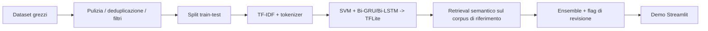

# Fake News Screening (HDSS)

[English](README.md) | **Italiano**

Un sistema ibrido di screening della disinformazione: una SVM calibrata, una
Bi-GRU e una Bi-LSTM votano su testi di notizie in inglese, supportate da una
ricerca per similarità *semantica* sui corpora di addestramento e da un flag
di revisione umana quando i modelli sono in disaccordo.
Nato come progetto universitario di IA, qui è stato ricostruito come una
pipeline pulita e riproducibile: **analisi del dataset → modelli → demo
Streamlit**.

Demo live: https://fake-news-screening.streamlit.app/

> **Il dato onesto:** l'ensemble ottiene **94,6%** su un test set in-domain
> senza leakage e **80,0%** su 30 scenari adversarial fuori dominio, con
> **zero falsi negativi** — non lascia mai passare una bufala; ogni errore è
> un falso positivo troppo prudente su un'affermazione vera. Il layer di
> retrieval serve a *trovare* i claim veri/falsi noti più simili, non ad
> affermare la verità partendo da una vicinanza tematica — vedi *"Due usi
> molto diversi degli embeddings"* più sotto per capire perché questa
> distinzione conta e quanto costa.

## Il problema del "99% di accuratezza"

I primi esperimenti sul corpus ISOT portavano *ogni* architettura oltre il
98% di accuratezza. Il notebook
[`notebooks/01_dataset_bias_analysis.ipynb`](notebooks/01_dataset_bias_analysis.ipynb)
documenta perché quei numeri sono un campanello d'allarme, non un risultato:

| Bias nei dati | Effetto |
|---|---|
| **Leakage stilistico** — gli articoli fake hanno in media 2,16 `!`/`?` per articolo e il 30% di maiuscole nei titoli, quelli veri 0,17 e 6% | i modelli imparano la punteggiatura, non il contenuto |
| **Leakage di fonte** — il 99,2% degli articoli "veri" contiene la dicitura `(Reuters)`, lo 0,0% di quelli falsi | l'etichetta è letteralmente scritta nel testo |
| **Cecità temporale** — solo politica USA 2015–2017, con volumi di veri/falsi disallineati nel tempo | tutto ciò che è successivo al 2018 (COVID, elezioni) è fuori dominio |

<p align="center">
  
  
</p>
<p align="center">
  
</p>

## Cosa fa il sistema per contrastarlo

1. **Fusione multi-dataset** — ISOT + WELFake (filtrato per qualità: lunghezza,
   rapporto di maiuscole, punteggiatura) + claim COVID-19, deduplicati: 53.661
   articoli unici.
2. **Protocollo di split rigoroso** — split train/test *prima* di qualunque
   oversampling; la quota COVID è bilanciata e potenziata ×3 solo sul lato
   training; tutti i modelli condividono lo stesso test set intatto (10.733
   articoli). Correggere solo questo protocollo ha spostato la SVM da un
   dichiarato ~98% a un reale 95,3%.
3. **Ensemble di modelli economici e trasparenti** — baseline TF-IDF +
   LinearSVC calibrata, più due RNN bidirezionali leggere (~1,3 MB ciascuna),
   servite come modelli TFLite tramite l'interprete `ai-edge-litert` (~10 MB)
   invece del runtime TensorFlow completo; il punteggio finale è la media
   semplice.
4. **Livello di retrieval di riferimento** — similarità di embeddings di
   frase ([`all-MiniLM-L6-v2`](https://huggingface.co/sentence-transformers/all-MiniLM-L6-v2))
   rispetto a snippet dei ~68k articoli noti come veri/falsi: riconosce un
   claim *riformulato*, non solo letterale. Questo è *retrieval su ciò che
   il sistema ha già visto*, *non* fact-checking, e la demo mostra
   esplicitamente le evidenze recuperate.
5. **Retrieval a livello di claim** — l'input è diviso in frasi simili a
   affermazioni verificabili, e ogni claim viene recuperato in modo
   indipendente, così l'interfaccia può mostrare, per ciascun claim, se
   corrisponde a un'affermazione falsa nota, a un articolo reale noto, o se
   non ha corrispondenze — etichette di *evidenza*, non giudizi di verità.
6. **Fallback di retrieval live** — i primi claim vengono controllati anche
   su fonti live gratuite (Google Fact Check quando è configurata una chiave
   API, altrimenti GDELT, con rate limiting). Un verdetto di fact-checking
   live ha la precedenza per quel claim; altrimenti decide il corpus
   committato, così il sistema funziona anche completamente offline.
7. **Flag di revisione umana** — quando i tre modelli sono in forte
   disaccordo (scarto > 0,40), il verdetto viene segnalato come a bassa
   affidabilità invece di essere presentato come certo.

## Pipeline e figure

La pipeline completa è documentata in [PIPELINE.md](PIPELINE.md). Mostra il
flusso end-to-end dai dataset grezzi al deploy su Streamlit.

Il livello di reporting è riassunto in [reports/README.md](reports/README.md),
che spiega cosa dimostra ciascun grafico qui sopra e perché è rilevante per il
sistema finale. Nel complesso, le tre figure documentano i modi di fallimento
che hanno spinto il progetto finale ad allontanarsi da un benchmark guidato
dalla sola accuratezza, verso un workflow di retrieval e revisione.

## Riepilogo della pipeline



## Risultati (tutti misurati, tutti riproducibili)

**In-domain** — test set condiviso, `python -m src.train` →
[`models/metrics.json`](models/metrics.json):

| Modello | Accuratezza | Precisione (fake) | Recall (fake) | F1 (fake) |
|---|---|---|---|---|
| SVM (TF-IDF, calibrata) | 95,3% | 94,8% | 94,9% | 94,8% |
| Bi-GRU | 92,9% | 93,0% | 91,0% | 92,0% |
| Bi-LSTM | 92,9% | 94,1% | 89,9% | 92,0% |
| **Ensemble (media)** | **94,6%** | 94,5% | 93,3% | 93,9% |

**Fuori dominio** — 30 scenari adversarial (hoax plausibili, verità scomode),
`python -m src.evaluate --adversarial` →
[`benchmarks/adversarial_results.json`](benchmarks/adversarial_results.json):

| Dominio | Accuratezza | Falsi positivi | Falsi negativi | Segnalati per revisione |
|---|---|---|---|---|
| Politica | 70% | 3 | 0 | 2 |
| COVID | 90% | 1 | 0 | 3 |
| Misto | 80% | 2 | 0 | 3 |
| **Totale** | **80,0%** | 6 | 0 | 8 |

Ogni errore è un **falso positivo su un'affermazione vera** ("Donald Trump ha
vinto le elezioni del 2016…" → FAKE): la finestra di addestramento 2015–2017
ha insegnato ai classificatori che brevi affermazioni fattuali sulla politica
USA *assomigliano* a esche da fake news, e il layer di retrieval
deliberatamente non le "salva" più trattando un articolo reale sullo stesso
tema come una prova (vedi la sezione successiva). È il bias temporale/stilistico
che sopravvive a ogni mitigazione — il motivo per cui la demo si presenta come
un aiuto allo screening, non come un oracolo di verità. Ciò che conta per uno
strumento anti-disinformazione è l'altra colonna: **zero falsi negativi**,
nessuna bufala lasciata passare.

## Cosa dicono i grafici

I grafici del report rispondono a tre domande prima ancora di guardare
l'accuratezza:

1. Il dataset lascia trapelare l'etichetta attraverso lo stile?
2. L'etichetta trapela attraverso marcatori di fonte?
3. La finestra temporale è troppo stretta per generalizzare?

Se anche solo una di queste risposte è "sì", le metriche del modello vanno
lette come stime valide solo in-domain. Per questo il portfolio mette in
primo piano il benchmark adversarial e la pipeline di retrieval/revisione,
invece del solo numero di accuratezza.

## Due usi molto diversi degli embeddings

TF-IDF, una SVM lineare e due piccole RNN sembrano datati rispetto ai
classificatori testuali attuali — perciò entrambi gli usi possibili degli
embeddings transformer sono stati testati su questo progetto, con risultati
opposti e ugualmente istruttivi.

**Classificazione: testata, respinta.** `experiments/` sostituisce la
baseline TF-IDF con embeddings di frase
([`all-MiniLM-L6-v2`](https://huggingface.co/sentence-transformers/all-MiniLM-L6-v2))
più un classificatore lineare calibrato, addestrato e valutato sullo
*stesso identico* dataset fuso e split di `src.train`
(`experiments/embeddings_baseline.py`, `experiments/embeddings_adversarial.py`).

| | In-domain | Fuori dominio (30 scenari) |
|---|---|---|
| Ensemble attuale (TF-IDF + SVM/GRU/LSTM) | 94,6% | 80,0% |
| Embeddings MiniLM + classificatore lineare | 88,5% | 60% |

Il classificatore basato su embeddings ha perso su entrambi i fronti — il
divario più netto è su WELFake (67,1% contro 86,9%) e sul dominio
adversarial "misto". È la conseguenza misurata del leakage documentato in
[`notebooks/01_dataset_bias_analysis.ipynb`](notebooks/01_dataset_bias_analysis.ipynb):
la distinzione fake/vero in questi corpora è guidata in gran parte da stile
superficiale e marcatori di fonte (punteggiatura, maiuscole, la dicitura
`(Reuters)`), e TF-IDF è costruito apposta per sfruttare esattamente quel
segnale letterale. Un modello di embedding semantico è costruito per
esserne invariante — quindi su questo dataset, capire *meglio* il
significato è uno svantaggio per la classificazione.

**Retrieval: testato, adottato.** Trovare il claim *noto* più vicino è un
compito diverso dalla classificazione, ed è esattamente ciò per cui gli
embeddings semantici sono fatti: far corrispondere "il vaccino COVID altera
il tuo codice genetico" a un claim salvato sul vaccino che "altera
permanentemente il DNA", pur con un vocabolario condiviso quasi nullo —
qualcosa che il vecchio livello di riferimento TF-IDF, basato sulla
sovrapposizione letterale di termini, non poteva fare per costruzione.
`src/rag.py` ora calcola una volta sola gli embeddings dei ~68k snippet del
corpus di riferimento (`REF_EMBEDDINGS_FILE`, committato, ~46 MB) e
confronta le query per similarità coseno. Anche i pesi del modello stesso
(`models/embedding_model/`, ~88 MB) sono committati invece di essere scaricati
da Hugging Face Hub a runtime — i container di Streamlit Cloud ripartono da un
filesystem pulito a ogni redeploy, e questo livello gira su *ogni* previsione,
non solo sul retrieval live, quindi un download da Hub all'avvio a freddo era
un rischio concreto: se la rete ha un intoppo, l'app semplicemente non parte.

**Il segnale di retrieval è volutamente asimmetrico — e l'asimmetria conta
più del numero in cima.** Una versione iniziale lasciava che *qualsiasi*
corrispondenza, vera o falsa, influenzasse il verdetto. Otteneva un 83,3%
adversarial più alto — ma in parte fabbricando verità: un'affermazione falsa
condivide di continuo il proprio argomento con notizie reali ("il vaccino
altera il tuo DNA" sta proprio accanto ad articoli veri sulla genetica del
COVID), quindi la demo mostrava un pannello verde "REAL / SUPPORTED"
*direttamente sotto un verdetto FAKE rosso*, arrivando a dare il via libera a
una teoria complottista sul vaccino. È esattamente il segnale sbagliato per
uno strumento anti-disinformazione. Perciò il layer di riferimento ora è
asimmetrico:

- Corrispondere a un claim **falso** noto è vera evidenza di falsità — alza il
  punteggio già da una similarità modesta, e un match quasi letterale può
  scavalcare l'ensemble.
- Corrispondere a un articolo **vero** noto afferma REAL solo se è *quasi
  letterale* (`REF_OVERRIDE_THRESHOLD = 0,90`); la semplice vicinanza tematica
  è mostrata come evidenza neutra ("lo snippet noto più vicino è reale al
  69%"), mai come un verdetto.

Questo costa circa tre punti di accuratezza adversarial (83,3% → 80,0%,
un'affermazione COVID vera non più "salvata" da un articolo reale sullo stesso
tema) — un costo che vale la pena pagare: i pannelli non possono più
contraddire il verdetto, e la demo non presenta mai un'affermazione falsa come
supportata. La similarità di embeddings semplicemente non separa "stesso claim,
riformulato" da "stesso argomento, claim diverso" con abbastanza nettezza da
essere trattata come segnale di verità, ma solo come evidenza recuperata.

**Perché entrambi sono diventati sostenibili insieme:** le RNN ora girano
come modelli TFLite tramite l'interprete `ai-edge-litert` (~10 MB) invece
del runtime TensorFlow completo (~500+ MB solo per il framework, a
prescindere dalla dimensione del modello). La memoria di picco misurata per
l'intero sistema — SVM, entrambe le RNN, il corpus di riferimento e il
modello di embeddings insieme — è di **~600 MB**, contro un limite di 1 GB
del piano gratuito di Streamlit Cloud. Tenere TensorFlow e PyTorch insieme
non ci sarebbe stato; rinunciare alle RNN o agli embeddings sarebbe stato un
compromesso inutile. L'addestramento avviene ancora con TensorFlow completo
(`requirements-train.txt`); solo l'app deployata doveva cambiare.

## Collocazione nella tassonomia del disordine informativo

"Fake news" è un'etichetta scientificamente inadeguata: il framework
*Information Disorder* di Wardle & Derakhshan (Consiglio d'Europa, 2017)
distingue **misinformation** (falso, condiviso senza intento dannoso),
**disinformation** (falso, intenzionalmente dannoso) e **malinformation**
(contenuto genuino usato per nuocere). Un classificatore testuale può
occuparsi solo del *segnale di falsità del contenuto* delle prime due — è
cieco all'intento, e per costruzione alla malinformation, dove il contenuto è
vero. Questa è una seconda ragione strutturale (oltre all'accuratezza
misurata fuori dominio) per cui il sistema è inquadrato come un **aiuto allo
screening dentro un processo umano**, non un arbitro automatico della verità.

Il benchmark adversarial versionato segue la stessa logica che la
letteratura sulla sicurezza cognitiva applica alle istituzioni — *non puoi
difendere ciò che non hai testato*: i 30 scenari restano nel repository come
uno stress test permanente e ripetibile, non un esperimento occasionale.

## Struttura del repository

```
├── app.py                  Demo Streamlit (solo UI)
├── src/
│   ├── config.py           ogni percorso, iperparametro e soglia
│   ├── data.py             caricamento / filtri / fusione / protocollo di split unificati
│   ├── train.py            addestra SVM + GRU + LSTM, esporta TFLite, scrive metrics.json
│   ├── predict.py          ScreeningSystem: ensemble + euristica + flag di revisione
│   ├── evaluate.py         report in-domain e benchmark adversarial
│   ├── rag.py              retrieval sul corpus di riferimento (embeddings semantici)
│   ├── claim_rag.py        analisi di retrieval per singolo claim
│   ├── external_retrieval.py  evidenza live (Google Fact Check / GDELT)
│   └── tokenizer.py        tokenizer indipendente dal framework (niente TF in produzione)
├── tests/                  suite pytest: protocollo di split, logica ensemble, retrieval
├── models/                 artefatti addestrati incl. RNN TFLite (~8 MB) e il
│                           modello di embedding committato (~88 MB)
├── reference_corpus/       snippet noti veri/falsi + embeddings (~55 MB)
├── benchmarks/             scenari versionati + risultati misurati
├── experiments/            alternative testate e scartate (vedi sopra)
├── notebooks/              analisi del bias del dataset (il "perché" del design)
├── reports/figures/        grafici esportati
└── data/                   dataset (non committati — vedi data/README.md)
```

## Avvio rapido

```bash
# Python 3.10 o 3.11
pip install -r requirements.txt

# Avvia la demo con i modelli già committati
streamlit run app.py

# Riproduci tutto da zero — servono i dataset (vedi data/README.md)
# E TensorFlow, usato solo per l'addestramento; l'app in sé non ne ha bisogno:
pip install -r requirements-train.txt
python -m src.train                  # ~10 min su CPU
python -m src.evaluate               # tabella metriche in-domain
python -m src.evaluate --adversarial # benchmark fuori dominio

# Esegui la suite di test (protocollo di split, logica ensemble, retrieval)
pip install -r requirements-dev.txt
python -m pytest tests/
```

## Deploy su Streamlit Cloud

Questo repository è già configurato per un deploy standard su Streamlit
Cloud.

Puoi aprire l'app già deployata direttamente su
https://fake-news-screening.streamlit.app/.

1. Collega il repository GitHub `lauratonsi/Fake_News_Screening`.
2. Usa `app.py` come entry point.
3. Mantieni `main` come branch predefinito.
4. Lascia che Streamlit installi le dipendenze da `requirements.txt` (include
   un indice PyTorch CPU-only per `torch`, così non scarica una build CUDA
   da svariati GB).
5. In **Advanced settings**, imposta la versione di Python a **3.11**.
6. I default di tema/server sono impostati in `.streamlit/config.toml`.

Se il deploy va a buon fine, la demo dovrebbe caricare i modelli già
committati in `models/` e `reference_corpus/` e funzionare senza bisogno di
riaddestramento né di TensorFlow — vedi *"Perché entrambi sono diventati
sostenibili insieme"* sopra per il conto della memoria dietro questa scelta.

## Retrieval live: configurazione e aspettative oneste

Il livello live (`src/external_retrieval.py`) interroga due fonti gratuite
per ogni claim, in ordine:

1. **Google Fact Check Tools** — solo se è impostata
   `GOOGLE_FACTCHECK_API_KEY`; un verdetto da qui ha precedenza su tutto
   il resto.
2. **GDELT** (nessuna chiave richiesta) — un motore di ricerca di notizie
   *live*, non un archivio di fact-checking.

GDELT funziona meglio per argomenti genuinamente attuali e in corso (tassi
d'interesse, un'elezione in corso, una pandemia in svolgimento). Diversi
esempi della demo e scenari adversarial testano intenzionalmente claim
*storici* (l'elezione del 2016, un licenziamento del 2017, claim COVID del
2020-21) — l'indice degli articoli di GDELT parte da circa febbraio 2017,
quindi un claim emerge solo se un articolo successivo lo menziona
retrospettivamente, con una formulazione più o meno simile. Vedere "nessuna
evidenza live trovata" su un esempio storico è un comportamento atteso, non
una funzionalità rotta; lo stesso codice restituisce affidabilmente articoli
reali per un claim su qualcosa che accade quest'anno.

**Per attivare il percorso di qualità superiore di Google Fact Check:**
1. Nella Google Cloud Console, abilita la "Fact Check Tools API" e crea una
   chiave API.
2. In locale: `export GOOGLE_FACTCHECK_API_KEY=la-tua-chiave` prima di
   `streamlit run app.py`.
3. Su Streamlit Community Cloud: apri **Settings → Secrets** dell'app e
   aggiungi
   ```toml
   GOOGLE_FACTCHECK_API_KEY = "la-tua-chiave"
   ```
   Streamlit Cloud espone i Secrets all'app come variabili d'ambiente, quindi
   non serve alcuna modifica al codice.

Senza chiave, l'app funziona esattamente come documentato sopra — Google
Fact Check viene saltato e GDELT resta il fallback.

## Limitazioni oneste

- Solo inglese; i corpora di addestramento si fermano sostanzialmente al
  2020 — gli eventi attuali sono fuori dominio.
- Il lookup di riferimento riconosce claim *già noti* (ora anche
  riformulati — vedi sopra); non può verificarne di genuinamente nuovi. La
  sua ricerca top-1 per vicinanza può anche confondere "stesso argomento"
  con "stesso claim" su input ambigui, motivo per cui scavalcare del tutto
  l'ensemble è riservato ai match quasi letterali
  (`REF_OVERRIDE_THRESHOLD = 0,90`).
- Le RNN sono addestrate su un sottocampione di 5.000 articoli (budget CPU);
  la SVM vede l'intero training set.
- L'accuratezza fuori dominio (80,0%) è il numero che conta per un uso
  reale, ed è il motivo per cui qualunque deploy di un sistema come questo
  richiede un essere umano nel ciclo.
