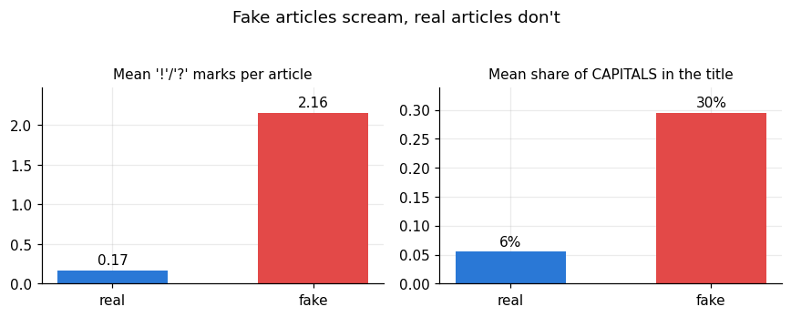
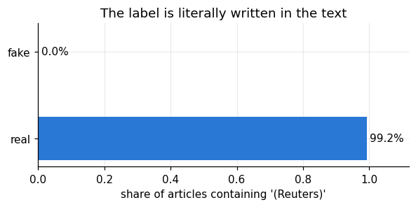
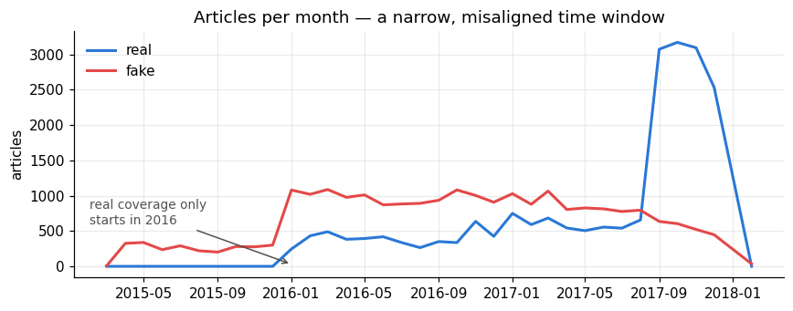
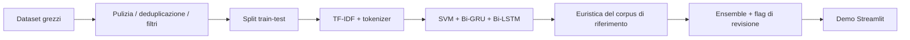

# Fake News Screening (HDSS)

[English](README.md) | **Italiano**

Un sistema ibrido di screening della disinformazione: una SVM calibrata, una
Bi-GRU e una Bi-LSTM votano su testi di notizie in inglese, supportate da una
ricerca per similarità sui corpora di addestramento e da un flag di revisione
umana quando i modelli sono in disaccordo.
Nato come progetto universitario di IA, qui è stato ricostruito come una
pipeline pulita e riproducibile: **analisi del dataset → modelli → demo
Streamlit**.

Demo live: https://fake-news-screening.streamlit.app/

> **Il dato onesto:** l'ensemble ottiene **93,6%** su un test set in-domain
> senza leakage, ma solo **70%** su 30 scenari adversarial fuori dominio.
> Questo divario — bias del dataset, non magia dei modelli — è il vero
> oggetto di questo progetto.

## Il problema del "99% di accuratezza"

I primi esperimenti sul corpus ISOT portavano *ogni* architettura oltre il
98% di accuratezza. Il notebook
[`notebooks/01_dataset_bias_analysis.ipynb`](notebooks/01_dataset_bias_analysis.ipynb)
documenta perché quei numeri sono un campanello d'allarme, non un risultato:

| Bias nei dati | Effetto |
|---|---|
| **Leakage stilistico** — gli articoli fake hanno in media 2,16 `!`/`?` per articolo e il 30% di maiuscole nei titoli, quelli veri 0,17 e 6% | i modelli imparano la punteggiatura, non il contenuto |
| **Leakage di fonte** — il 99,2% degli articoli "veri" contiene la dicitura `(Reuters)`, lo 0,0% di quelli falsi | l'etichetta è letteralmente scritta nel testo |
| **Cecità temporale** — solo politica USA 2015–2017, con volumi di veri/falsi disallineati nel tempo | tutto ciò che è successivo al 2018 (COVID, elezioni) è fuori dominio |

<p align="center">
  
  
</p>
<p align="center">
  
</p>

## Cosa fa il sistema per contrastarlo

1. **Fusione multi-dataset** — ISOT + WELFake (filtrato per qualità: lunghezza,
   rapporto di maiuscole, punteggiatura) + claim COVID-19, deduplicati: 53.661
   articoli unici.
2. **Protocollo di split rigoroso** — split train/test *prima* di qualunque
   oversampling; la quota COVID è bilanciata e potenziata ×3 solo sul lato
   training; tutti i modelli condividono lo stesso test set intatto (10.733
   articoli). Correggere solo questo protocollo ha spostato la SVM da un
   dichiarato ~98% a un reale 95,3%.
3. **Ensemble di modelli economici e trasparenti** — baseline TF-IDF +
   LinearSVC calibrata, più due RNN bidirezionali leggere (~1,3 MB ciascuna);
   il punteggio finale è la media semplice.
4. **Livello di retrieval di riferimento** — similarità coseno rispetto a
   snippet dei ~68k articoli noti come veri/falsi. Questo è *retrieval su ciò
   che il sistema ha già visto*, *non* fact-checking, e la demo mostra
   esplicitamente le evidenze recuperate.
5. **Retrieval a livello di claim** — l'input è diviso in frasi simili a
   affermazioni verificabili, e ogni claim viene recuperato in modo
   indipendente, così l'interfaccia può mostrare affermazioni supportate,
   confutate o non supportate.
6. **Fallback di retrieval live** — i primi claim vengono controllati anche
   su fonti live gratuite (Google Fact Check quando è configurata una chiave
   API, altrimenti GDELT, con rate limiting). Un verdetto di fact-checking
   live ha la precedenza per quel claim; altrimenti decide il corpus
   committato, così il sistema funziona anche completamente offline.
7. **Flag di revisione umana** — quando i tre modelli sono in forte
   disaccordo (scarto > 0,40), il verdetto viene segnalato come a bassa
   affidabilità invece di essere presentato come certo.

## Pipeline e figure

La pipeline completa è documentata in [PIPELINE.md](PIPELINE.md). Mostra il
flusso end-to-end dai dataset grezzi al deploy su Streamlit.

Il livello di reporting è riassunto in [reports/README.md](reports/README.md),
che spiega cosa dimostra ciascun grafico qui sopra e perché è rilevante per il
sistema finale. Nel complesso, le tre figure documentano i modi di fallimento
che hanno spinto il progetto finale ad allontanarsi da un benchmark guidato
dalla sola accuratezza, verso un workflow di retrieval e revisione.

## Riepilogo della pipeline



## Risultati (tutti misurati, tutti riproducibili)

**In-domain** — test set condiviso, `python -m src.train` →
[`models/metrics.json`](models/metrics.json):

| Modello | Accuratezza | Precisione (fake) | Recall (fake) | F1 (fake) |
|---|---|---|---|---|
| SVM (TF-IDF, calibrata) | 95,3% | 94,8% | 94,9% | 94,8% |
| Bi-GRU | 91,5% | 95,9% | 84,7% | 89,9% |
| Bi-LSTM | 90,8% | 91,3% | 87,9% | 89,6% |
| **Ensemble (media)** | **93,6%** | 96,0% | 89,5% | 92,6% |

**Fuori dominio** — 30 scenari adversarial (hoax plausibili, verità scomode),
`python -m src.evaluate --adversarial` →
[`benchmarks/adversarial_results.json`](benchmarks/adversarial_results.json):

| Dominio | Accuratezza | Falsi positivi | Falsi negativi | Segnalati per revisione |
|---|---|---|---|---|
| Politica | 60% | 4 | 0 | 3 |
| COVID | 80% | 1 | 1 | 2 |
| Misto | 70% | 2 | 1 | 1 |
| **Totale** | **70%** | 7 | 2 | 6 |

Il fallimento dominante è **falsi positivi su affermazioni politiche vere**
("Obama ha servito due mandati…" → FAKE): la finestra di addestramento
2015–2017 ha insegnato ai modelli che brevi affermazioni fattuali sulla
politica USA *assomigliano* a esche da fake news. È il bias
temporale/stilistico che sopravvive a ogni mitigazione — ed è il motivo per
cui la demo si presenta come un aiuto allo screening, non come un oracolo di
verità.

## Cosa dicono i grafici

I grafici del report rispondono a tre domande prima ancora di guardare
l'accuratezza:

1. Il dataset lascia trapelare l'etichetta attraverso lo stile?
2. L'etichetta trapela attraverso marcatori di fonte?
3. La finestra temporale è troppo stretta per generalizzare?

Se anche solo una di queste risposte è "sì", le metriche del modello vanno
lette come stime valide solo in-domain. Per questo il portfolio mette in
primo piano il benchmark adversarial e la pipeline di retrieval/revisione,
invece del solo numero di accuratezza.

## Collocazione nella tassonomia del disordine informativo

"Fake news" è un'etichetta scientificamente inadeguata: il framework
*Information Disorder* di Wardle & Derakhshan (Consiglio d'Europa, 2017)
distingue **misinformation** (falso, condiviso senza intento dannoso),
**disinformation** (falso, intenzionalmente dannoso) e **malinformation**
(contenuto genuino usato per nuocere). Un classificatore testuale può
occuparsi solo del *segnale di falsità del contenuto* delle prime due — è
cieco all'intento, e per costruzione alla malinformation, dove il contenuto è
vero. Questa è una seconda ragione strutturale (oltre all'accuratezza
misurata fuori dominio) per cui il sistema è inquadrato come un **aiuto allo
screening dentro un processo umano**, non un arbitro automatico della verità.

Il benchmark adversarial versionato segue la stessa logica che la
letteratura sulla sicurezza cognitiva applica alle istituzioni — *non puoi
difendere ciò che non hai testato*: i 30 scenari restano nel repository come
uno stress test permanente e ripetibile, non un esperimento occasionale.

## Struttura del repository

```
├── app.py                  Demo Streamlit (solo UI)
├── src/
│   ├── config.py           ogni percorso, iperparametro e soglia
│   ├── data.py             caricamento / filtri / fusione / protocollo di split unificati
│   ├── train.py            addestra SVM + GRU + LSTM, scrive metrics.json
│   ├── predict.py          ScreeningSystem: ensemble + euristica + flag di revisione
│   └── evaluate.py         report in-domain e benchmark adversarial
├── models/                 artefatti addestrati (~8 MB, committati)
├── reference_corpus/       snippet noti veri/falsi per l'euristica (~9 MB)
├── benchmarks/             scenari versionati + risultati misurati
├── notebooks/              analisi del bias del dataset (il "perché" del design)
├── reports/figures/        grafici esportati
└── data/                   dataset (non committati — vedi data/README.md)
```

## Avvio rapido

```bash
# Python 3.10 o 3.11
pip install -r requirements.txt

# Avvia la demo con i modelli già committati
streamlit run app.py

# Riproduci tutto da zero (servono i dataset, vedi data/README.md)
python -m src.train                  # ~10 min su CPU
python -m src.evaluate               # tabella metriche in-domain
python -m src.evaluate --adversarial # benchmark fuori dominio
```

## Deploy su Streamlit Cloud

Questo repository è già configurato per un deploy standard su Streamlit
Cloud.

Puoi aprire l'app già deployata direttamente su
https://fake-news-screening.streamlit.app/.

1. Collega il repository GitHub `lauratonsi/Fake_News_Screening`.
2. Usa `app.py` come entry point.
3. Mantieni `main` come branch predefinito.
4. Lascia che Streamlit installi le dipendenze da `requirements.txt`.
5. In **Advanced settings**, imposta la versione di Python a **3.11**.
   TensorFlow 2.15 non funziona su Python 3.13+ e l'app non si installerà
   correttamente se Streamlit usa l'interprete più recente di default.
6. I default di tema/server sono impostati in `.streamlit/config.toml`.

Se il deploy va a buon fine, la demo dovrebbe caricare i modelli già
committati in `models/` e funzionare senza bisogno di riaddestramento.

## Limitazioni oneste

- Solo inglese; i corpora di addestramento si fermano sostanzialmente al
  2020 — gli eventi attuali sono fuori dominio.
- Il lookup di riferimento riconosce claim *già noti*; non può verificarne
  di nuovi.
- Le RNN sono addestrate su un sottocampione di 5.000 articoli (budget CPU);
  la SVM vede l'intero training set.
- L'accuratezza fuori dominio (70%) è il numero che conta per un uso reale,
  ed è il motivo per cui qualunque deploy di un sistema come questo richiede
  un essere umano nel ciclo.
