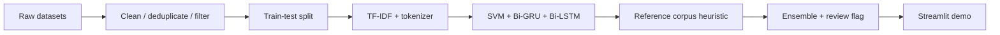

# Fake News Screening (HDSS)

A hybrid disinformation screening system: a calibrated SVM, a Bi-GRU and a
Bi-LSTM vote on English news text, backed by a similarity lookup against the
training corpora and a human-review flag when the models disagree.
Originally developed as a university AI project, rebuilt here as a clean,
reproducible pipeline: **dataset analysis → models → Streamlit demo**.

> **The honest headline:** the ensemble scores **93.6%** on a leakage-free
> in-domain test set, but only **70%** on 30 out-of-domain adversarial
> scenarios. That gap — dataset bias, not model magic — is what this project
> is actually about.

## The problem with "99% accuracy"

Early experiments on the ISOT corpus put *every* architecture above 98%
accuracy. [`notebooks/01_dataset_bias_analysis.ipynb`](notebooks/01_dataset_bias_analysis.ipynb)
documents why those numbers are a red flag rather than a result:

| Bias in the data | Effect |
|---|---|
| **Stylistic leakage** — fake articles average 2.16 `!`/`?` per article and 30% capitals in titles, real ones 0.17 and 6% | models learn punctuation, not content |
| **Source leakage** — 99.2% of "real" articles contain the `(Reuters)` dateline, 0.0% of fake ones | the label is literally written in the text |
| **Temporal blindness** — 2015–2017 US politics only, with fake/real volumes misaligned in time | anything post-2018 (COVID, elections) is out of domain |

## What the system does about it

1. **Multi-dataset fusion** — ISOT + WELFake (quality-filtered: length, caps
   ratio, punctuation) + COVID-19 claims, deduplicated: 53,661 unique articles.
2. **Strict split protocol** — train/test split *before* any oversampling;
   the COVID slice is balanced and boosted ×3 on the training side only; all
   models share the same untouched test set (10,733 articles).
   Fixing this protocol alone moved the SVM from a claimed ~98% to a real 95.3%.
3. **Ensemble of cheap, transparent models** — TF-IDF + calibrated LinearSVC
   baseline, plus two light bidirectional RNNs (~1.3 MB each); final score is
   the simple average.
4. **Reference retrieval layer** — cosine similarity against snippets of the
   ~68k known real/fake articles. This is *retrieval over what the system has
   already seen*, *not* fact-checking, and the demo shows the retrieved
   evidence explicitly.
5. **Claim-level retrieval** — the input is split into claim-like sentences
   and each claim is retrieved independently, so the UI can show supported,
   refuted, or unsupported statements.
6. **Live retrieval fallback** — claim analysis can query free live sources
    first and fall back to the committed corpus when there is no strong live
    evidence.
7. **Human-review flag** — when the three models disagree strongly
   (spread > 0.40), the verdict is marked low-confidence instead of being
   reported as certain.

## Pipeline & Figures

The full pipeline is documented in [PIPELINE.md](PIPELINE.md). It shows the
end-to-end flow from raw datasets to Streamlit deployment and collects the key
bias-analysis figures:

- [Reuters leakage](reports/figures/reuters_leakage.png)
- [Style leakage](reports/figures/style_leakage.png)
- [Temporal window](reports/figures/temporal_window.png)

## Pipeline summary



## Results (all measured, all reproducible)

**In-domain** — shared held-out test set, `python -m src.train` →
[`models/metrics.json`](models/metrics.json):

| Model | Accuracy | Precision (fake) | Recall (fake) | F1 (fake) |
|---|---|---|---|---|
| SVM (TF-IDF, calibrated) | 95.3% | 94.8% | 94.9% | 94.8% |
| Bi-GRU | 91.5% | 95.9% | 84.7% | 89.9% |
| Bi-LSTM | 90.8% | 91.3% | 87.9% | 89.6% |
| **Ensemble (mean)** | **93.6%** | 96.0% | 89.5% | 92.6% |

**Out-of-domain** — 30 adversarial scenarios (plausible hoaxes, uncomfortable
truths), `python -m src.evaluate --adversarial` →
[`benchmarks/adversarial_results.json`](benchmarks/adversarial_results.json):

| Domain | Accuracy | False positives | False negatives | Flagged for review |
|---|---|---|---|---|
| Politics | 60% | 4 | 0 | 3 |
| COVID | 80% | 1 | 1 | 2 |
| Mixed | 70% | 2 | 1 | 1 |
| **Overall** | **70%** | 7 | 2 | 6 |

The dominant failure mode is **false positives on true political statements**
("Obama served two terms…" → FAKE): the 2015–2017 training window taught the
models that short factual claims about US politics *look like* fake-news bait.
This is the temporal/stylistic bias surviving every mitigation — and the reason
the demo presents itself as a screening aid, not a truth oracle.

## Scope within the information-disorder taxonomy

"Fake news" is a scientifically inadequate label: Wardle & Derakhshan's
*Information Disorder* framework (Council of Europe, 2017) distinguishes
**misinformation** (false, shared without harmful intent), **disinformation**
(false, intentionally harmful) and **malinformation** (genuine content used to
harm). A text classifier can only ever address the *content-falsity signal* of
the first two — it is blind to intent, and by construction to malinformation,
where the content is true. That is a second, structural reason (besides the
measured out-of-domain accuracy) why this system is framed as a **screening
aid inside a human process**, not an automated arbiter of truth.

The versioned adversarial benchmark follows the same logic that cognitive
security literature applies to institutions — *you cannot defend what you have
not tested*: the 30 scenarios are kept in the repo as a permanent, repeatable
stress test rather than a one-off experiment.

## Repository layout

```
├── app.py                  Streamlit demo (UI only)
├── src/
│   ├── config.py           every path, hyperparameter and threshold
│   ├── data.py             unified load / filter / fuse / split protocol
│   ├── train.py            trains SVM + GRU + LSTM, writes metrics.json
│   ├── predict.py          ScreeningSystem: ensemble + heuristic + review flag
│   └── evaluate.py         in-domain report & adversarial benchmark
├── models/                 trained artifacts (~8 MB, committed)
├── reference_corpus/       known real/fake snippets for the heuristic (~9 MB)
├── benchmarks/             versioned scenarios + measured results
├── notebooks/              dataset bias analysis (the "why" of the design)
├── reports/figures/        exported charts
└── data/                   datasets (not committed — see data/README.md)
```

## Quickstart

```bash
# Python 3.10 or 3.11
pip install -r requirements.txt

# Run the demo with the committed models
streamlit run app.py

# Reproduce everything from scratch (needs the datasets, see data/README.md)
python -m src.train                  # ~10 min on CPU
python -m src.evaluate               # in-domain metrics table
python -m src.evaluate --adversarial # out-of-domain benchmark
```

## Deploy on Streamlit Cloud

This repository is already configured for a standard Streamlit Cloud deploy.

1. Connect the GitHub repository `lauratonsi/Fake_News_Screening`.
2. Use `app.py` as the entry point.
3. Keep the default branch as `main`.
4. Let Streamlit install dependencies from `requirements.txt`.
5. In **Advanced settings**, set the Python version to **3.11**. TensorFlow
   2.15 does not work on Python 3.13+ and the app will fail to install if
   Streamlit uses the newer default interpreter.
6. The app theme/server defaults are set in `.streamlit/config.toml`.

If the deployment succeeds, the demo should load the committed models from
`models/` and run without requiring retraining.

## Honest limitations

- English only; the training corpora essentially stop in 2020 — current events are out of domain.
- The reference lookup recognises *known* claims; it cannot verify new ones.
- The RNNs are trained on a 5,000-article subsample (CPU budget); the SVM sees
  the full training set.
- Out-of-domain accuracy (70%) is the number that matters for real-world use,
  and it is why any deployment of a system like this needs a human in the loop.
