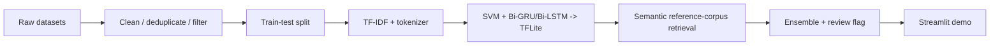

# Fake News Screening (HDSS)

**English** | [Italiano](README.it.md)

A hybrid disinformation screening system: a calibrated SVM, a Bi-GRU and a
Bi-LSTM vote on English news text, backed by a *semantic* similarity lookup
against the training corpora and a human-review flag when the models
disagree. Originally developed as a university AI project, rebuilt here as a
clean, reproducible pipeline: **dataset analysis → models → Streamlit demo**.

Live demo: https://fake-news-screening.streamlit.app/

> **The honest headline:** the ensemble scores **94.6%** on a leakage-free
> in-domain test set and **83.3%** on 30 out-of-domain adversarial scenarios.
> That gap narrowed a lot (it was 23.6 points, now 11.3) once retrieval
> switched from literal word overlap to real sentence embeddings — see
> *"Two very different uses of embeddings"* below for why that upgrade
> helped retrieval but would have hurt classification.

## The problem with "99% accuracy"

Early experiments on the ISOT corpus put *every* architecture above 98%
accuracy. [`notebooks/01_dataset_bias_analysis.ipynb`](notebooks/01_dataset_bias_analysis.ipynb)
documents why those numbers are a red flag rather than a result:

| Bias in the data | Effect |
|---|---|
| **Stylistic leakage** — fake articles average 2.16 `!`/`?` per article and 30% capitals in titles, real ones 0.17 and 6% | models learn punctuation, not content |
| **Source leakage** — 99.2% of "real" articles contain the `(Reuters)` dateline, 0.0% of fake ones | the label is literally written in the text |
| **Temporal blindness** — 2015–2017 US politics only, with fake/real volumes misaligned in time | anything post-2018 (COVID, elections) is out of domain |

<p align="center">
  
  
</p>
<p align="center">
  
</p>

## What the system does about it

1. **Multi-dataset fusion** — ISOT + WELFake (quality-filtered: length, caps
   ratio, punctuation) + COVID-19 claims, deduplicated: 53,661 unique articles.
2. **Strict split protocol** — train/test split *before* any oversampling;
   the COVID slice is balanced and boosted ×3 on the training side only; all
   models share the same untouched test set (10,733 articles).
   Fixing this protocol alone moved the SVM from a claimed ~98% to a real 95.3%.
3. **Ensemble of cheap, transparent models** — TF-IDF + calibrated LinearSVC
   baseline, plus two light bidirectional RNNs (~1.3 MB each), served as
   TFLite models via the ~10 MB `ai-edge-litert` interpreter rather than the
   full TensorFlow runtime; final score is the simple average.
4. **Reference retrieval layer** — sentence-embedding similarity
   ([`all-MiniLM-L6-v2`](https://huggingface.co/sentence-transformers/all-MiniLM-L6-v2))
   against snippets of the ~68k known real/fake articles: it matches a
   *reworded* claim, not just a literal one. This is *retrieval over what
   the system has already seen*, *not* fact-checking, and the demo shows the
   retrieved evidence explicitly.
5. **Claim-level retrieval** — the input is split into claim-like sentences
   and each claim is retrieved independently, so the UI can show supported,
   refuted, or unsupported statements.
6. **Live retrieval fallback** — the first few claims are also checked against
    free live sources (Google Fact Check when an API key is configured, GDELT
    otherwise, rate-limited). A live fact-check verdict takes precedence for
    that claim; otherwise the committed corpus decides, so the system works
    fully offline too.
7. **Human-review flag** — when the three models disagree strongly
   (spread > 0.40), the verdict is marked low-confidence instead of being
   reported as certain.

## Pipeline & Figures

The full pipeline is documented in [PIPELINE.md](PIPELINE.md). It shows the
end-to-end flow from raw datasets to Streamlit deployment.

The reporting layer is summarized in [reports/README.md](reports/README.md),
which explains what each chart above proves and why it matters for the final
system. Taken together, the three figures document the failure modes that
forced the final design away from a plain accuracy-driven benchmark and
toward a retrieval-plus-review workflow.

## Pipeline summary



## Results (all measured, all reproducible)

**In-domain** — shared held-out test set, `python -m src.train` →
[`models/metrics.json`](models/metrics.json):

| Model | Accuracy | Precision (fake) | Recall (fake) | F1 (fake) |
|---|---|---|---|---|
| SVM (TF-IDF, calibrated) | 95.3% | 94.8% | 94.9% | 94.8% |
| Bi-GRU | 92.9% | 93.0% | 91.0% | 92.0% |
| Bi-LSTM | 92.9% | 94.1% | 89.9% | 92.0% |
| **Ensemble (mean)** | **94.6%** | 94.5% | 93.3% | 93.9% |

**Out-of-domain** — 30 adversarial scenarios (plausible hoaxes, uncomfortable
truths), `python -m src.evaluate --adversarial` →
[`benchmarks/adversarial_results.json`](benchmarks/adversarial_results.json):

| Domain | Accuracy | False positives | False negatives | Flagged for review |
|---|---|---|---|---|
| Politics | 70% | 3 | 0 | 2 |
| COVID | 100% | 0 | 0 | 3 |
| Mixed | 80% | 2 | 0 | 3 |
| **Overall** | **83.3%** | 5 | 0 | 8 |

Switching the reference layer from TF-IDF to semantic embeddings (see below)
took this from 70% to 83.3% and eliminated every false negative — the
remaining errors are **false positives on true political statements**
("Obama served two terms…" → FAKE): the 2015–2017 training window taught the
classifiers that short factual claims about US politics *look like*
fake-news bait, and none of the retrieval layers have seen that specific
true sentence before. This is the temporal/stylistic bias surviving every
mitigation — and the reason the demo presents itself as a screening aid, not
a truth oracle.

## Reporting Takeaways

The report charts are meant to answer three questions before anyone looks at
accuracy:

1. Is the dataset leaking the label through style?
2. Is the label leaking through source markers?
3. Is the temporal window too narrow to support generalization?

If any of those answers is "yes", the model metrics need to be read as
in-domain estimates only. That is why the portfolio now foregrounds the
adversarial benchmark and the retrieval/review pipeline instead of just the
headline accuracy number.

## Two very different uses of embeddings

TF-IDF, a linear SVM and two small RNNs look dated next to current text
classifiers — so both uses of transformer embeddings were tested on this
project, with opposite, equally instructive results.

**Classification: tested, rejected.** `experiments/` replaces the TF-IDF
baseline with sentence embeddings
([`all-MiniLM-L6-v2`](https://huggingface.co/sentence-transformers/all-MiniLM-L6-v2))
plus a calibrated linear classifier, trained and evaluated on the *exact
same* fused dataset and split as `src.train`
(`experiments/embeddings_baseline.py`, `experiments/embeddings_adversarial.py`).

| | In-domain | Out-of-domain (30 scenarios) |
|---|---|---|
| Current ensemble (TF-IDF + SVM/GRU/LSTM) | 94.6% | 83.3% |
| MiniLM embeddings + linear classifier | 88.5% | 60% |

The embeddings-based classifier lost on both axes — sharpest on WELFake
(67.1% vs. 86.9%) and on the adversarial "mixed" domain. This is the measured
consequence of the leakage documented in
[`notebooks/01_dataset_bias_analysis.ipynb`](notebooks/01_dataset_bias_analysis.ipynb):
the fake/real split in these corpora is driven largely by surface style and
source markers (punctuation, capitalization, the `(Reuters)` dateline), and
TF-IDF is built to exploit exactly that literal signal. A semantic embedding
model is built to be invariant to it — so on this dataset, understanding
meaning *better* is a handicap for classification.

**Retrieval: tested, adopted.** Finding the closest *known* claim is a
different task from classification, and it is exactly what semantic
embeddings are good at: matching "the COVID shot alters your genetic code"
to a stored claim about the vaccine "permanently altering DNA" despite
almost no shared vocabulary — something the old TF-IDF reference layer,
built on literal term overlap, structurally could not do. `src/rag.py` now
embeds the ~68k-snippet reference corpus once (`REF_EMBEDDINGS_FILE`,
committed, ~46 MB) and compares queries against it by cosine similarity.
Swapping this one layer took the adversarial benchmark from 70% to 83.3%
and eliminated every false negative.

One calibration lesson from making the switch: embedding similarity does
**not** separate "same claim, reworded" from "same topic, different claim"
as cleanly as TF-IDF's near-literal matches did. On the 30 adversarial
scenarios, 3 of 4 wrong reference-only calls scored 0.69–0.82 — well above
the override threshold carried over from the TF-IDF version (0.65).
`REF_OVERRIDE_THRESHOLD` is now 0.90: only near-verbatim repeats of a known
snippet override the ensemble outright, everything else only nudges the
score (`REF_BOOST`).

**Why both were affordable at once:** the RNNs now run as TFLite models via
the ~10 MB `ai-edge-litert` interpreter instead of the full TensorFlow
runtime (~500+ MB just for the framework, regardless of model size).
Measured peak memory for the whole system — SVM, both RNNs, the reference
corpus, and the sentence-embedding model together — is **~600 MB**, against
a free-tier Streamlit Cloud ceiling of 1 GB. Running TensorFlow and PyTorch
side by side would not have fit; running neither RNNs nor embeddings would
have been a needless trade-off. Training still happens in full TensorFlow
(`requirements-train.txt`); only the deployed app needed to change.

## Scope within the information-disorder taxonomy

"Fake news" is a scientifically inadequate label: Wardle & Derakhshan's
*Information Disorder* framework (Council of Europe, 2017) distinguishes
**misinformation** (false, shared without harmful intent), **disinformation**
(false, intentionally harmful) and **malinformation** (genuine content used to
harm). A text classifier can only ever address the *content-falsity signal* of
the first two — it is blind to intent, and by construction to malinformation,
where the content is true. That is a second, structural reason (besides the
measured out-of-domain accuracy) why this system is framed as a **screening
aid inside a human process**, not an automated arbiter of truth.

The versioned adversarial benchmark follows the same logic that cognitive
security literature applies to institutions — *you cannot defend what you have
not tested*: the 30 scenarios are kept in the repo as a permanent, repeatable
stress test rather than a one-off experiment.

## Repository layout

```
├── app.py                  Streamlit demo (UI only)
├── src/
│   ├── config.py           every path, hyperparameter and threshold
│   ├── data.py             unified load / filter / fuse / split protocol
│   ├── train.py            trains SVM + GRU + LSTM, exports TFLite, writes metrics.json
│   ├── predict.py          ScreeningSystem: ensemble + heuristic + review flag
│   ├── evaluate.py         in-domain report & adversarial benchmark
│   ├── rag.py              reference-corpus retrieval (semantic embeddings)
│   ├── claim_rag.py        per-claim retrieval analysis
│   ├── external_retrieval.py  live evidence (Google Fact Check / GDELT)
│   └── tokenizer.py        framework-independent tokenizer (no TF at serving time)
├── tests/                  pytest suite: split protocol, ensemble logic, retrieval
├── models/                 trained artifacts incl. TFLite RNNs (~8 MB, committed)
├── reference_corpus/       known real/fake snippets + embeddings (~55 MB)
├── benchmarks/             versioned scenarios + measured results
├── experiments/            tested-and-rejected alternatives (see below)
├── notebooks/              dataset bias analysis (the "why" of the design)
├── reports/figures/        exported charts
└── data/                   datasets (not committed — see data/README.md)
```

## Quickstart

```bash
# Python 3.10 or 3.11
pip install -r requirements.txt

# Run the demo with the committed models
streamlit run app.py

# Reproduce everything from scratch — needs the datasets (see data/README.md)
# AND TensorFlow, only used for training; the app itself does not need it:
pip install -r requirements-train.txt
python -m src.train                  # ~10 min on CPU
python -m src.evaluate               # in-domain metrics table
python -m src.evaluate --adversarial # out-of-domain benchmark

# Run the test suite (split protocol, ensemble logic, retrieval)
pip install -r requirements-dev.txt
python -m pytest tests/
```

## Deploy on Streamlit Cloud

This repository is already configured for a standard Streamlit Cloud deploy.

You can open the deployed app directly at
https://fake-news-screening.streamlit.app/.

1. Connect the GitHub repository `lauratonsi/Fake_News_Screening`.
2. Use `app.py` as the entry point.
3. Keep the default branch as `main`.
4. Let Streamlit install dependencies from `requirements.txt` (it includes a
   CPU-only PyTorch index for `torch`, so it does not pull in a multi-GB
   CUDA build).
5. In **Advanced settings**, set the Python version to **3.11**.
6. The app theme/server defaults are set in `.streamlit/config.toml`.

If the deployment succeeds, the demo should load the committed models from
`models/` and `reference_corpus/` and run without requiring retraining or
TensorFlow — see *"Why both were affordable at once"* above for the memory
budget behind that.

## Live retrieval: setup and honest expectations

The live layer (`src/external_retrieval.py`) queries two free sources per
claim, in order:

1. **Google Fact Check Tools** — only if `GOOGLE_FACTCHECK_API_KEY` is set; a
   verdict from here takes precedence over everything else.
2. **GDELT** (no key needed) — a live *news* search engine, not a
   fact-checking archive.

GDELT works best for genuinely current, ongoing topics (interest rates, an
election in progress, an unfolding pandemic). Several of this project's demo
examples and adversarial scenarios intentionally test *historical* claims
(the 2016 election, a 2017 firing, 2020-21 COVID claims) — GDELT's article
index starts around February 2017, so a claim only surfaces if some later
article happens to mention it retrospectively, in roughly matching phrasing.
Seeing "No live evidence found" on a historical example is expected
behavior, not a broken feature; the same code reliably returns real articles
for a claim about something happening this year.

**To enable the higher-quality Google Fact Check path:**
1. In Google Cloud Console, enable the "Fact Check Tools API" and create an
   API key.
2. Locally: `export GOOGLE_FACTCHECK_API_KEY=your-key-here` before
   `streamlit run app.py`.
3. On Streamlit Community Cloud: open the app's **Settings → Secrets** and
   add
   ```toml
   GOOGLE_FACTCHECK_API_KEY = "your-key-here"
   ```
   Streamlit Cloud exposes Secrets to the app as environment variables, so no
   code change is needed.

Without a key, the app still works exactly as documented above — Google
Fact Check is skipped and GDELT is the fallback.

## Honest limitations

- English only; the training corpora essentially stop in 2020 — current events are out of domain.
- The reference lookup recognises *known* claims (now including reworded
  ones — see above); it cannot verify genuinely new ones. Its top-1
  nearest-neighbor search can also confuse "same topic" with "same claim"
  for ambiguous inputs, which is why overriding the ensemble outright is
  reserved for near-verbatim matches (`REF_OVERRIDE_THRESHOLD = 0.90`).
- The RNNs are trained on a 5,000-article subsample (CPU budget); the SVM sees
  the full training set.
- Out-of-domain accuracy (83.3%) is the number that matters for real-world
  use, and it is why any deployment of a system like this needs a human in
  the loop.
