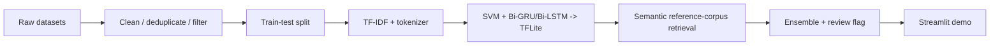

# Fake News Screening (HDSS)

**English** | [Italiano](README.it.md)

A hybrid disinformation screening system: a calibrated SVM, a Bi-GRU and a
Bi-LSTM vote on English news text, backed by a *semantic* similarity lookup
against the training corpora and a human-review flag when the models
disagree. Originally developed as a university AI project, rebuilt here as a
clean, reproducible pipeline: **dataset analysis → models → Streamlit demo**.

Live demo: https://fake-news-screening.streamlit.app/

> **The honest headline:** the ensemble scores **94.6%** on a leakage-free
> in-domain test set and **73.7%** on 76 out-of-domain adversarial scenarios
> spanning short claims and long articles, six topic domains, and two
> disinformation *styles*. Against classic, human-typical disinformation
> (secret, leaked, whistleblower-style tropes) it holds **zero false
> negatives** — no such hoax is ever waved through. Against fluent,
> source-attributed prose with none of those tropes, tested on 18 real
> ChatGPT-3.5 paraphrases and rewrites of documented misinformation (not
> written by this project — see below for why that matters), recall drops to
> **61%** — a real, moderate gap that *widened* as the sample grew from 6 to
> 18, the opposite of what a first, smaller pass suggested. That evolution,
> not a single number, is the honest finding: see *"AI-generated
> disinformation is harder to detect"* below. The
> retrieval layer is used to *find* the closest known real/fake claims, not to
> assert truth from topical similarity — see *"Two very different uses of
> embeddings"* for why that distinction matters and what it costs.

## Motivation & research context

This tool grew out of a study on **cognitive security** — the protection of
human judgement from deliberate manipulation. The premise is that the frontier
of security has moved: modern hybrid operations increasingly target *how people
decide* rather than the machines they use, so the classic CIA triad
(confidentiality, integrity, availability) no longer covers the whole attack
surface. Generative AI sharpens the asymmetry — a hostile actor can now
manufacture thousands of persuasive, native-sounding variants of a false story
at near-zero marginal cost, while verification stays slow and expensive.

Two ideas from that work shape the design directly:

- **"Fake news" is the wrong unit of analysis.** Wardle & Derakhshan's
  *Information Disorder* framework (Council of Europe, 2017) separates
  *misinformation* (false, shared without intent to harm), *disinformation*
  (false, deliberately harmful) and *malinformation* (true content weaponised
  to harm). A text classifier can only ever touch the content-falsity signal of
  the first two — it is blind to intent, and structurally blind to
  malinformation, where the content is true. So the honest ceiling of a system
  like this is **screening, not verdict**: it belongs inside a human process,
  not in place of one.
- **You cannot defend what you have not tested.** The same reason security
  teams run adversarial exercises is why the out-of-domain scenarios live in
  the repo as a permanent, repeatable stress test (see the benchmark below)
  rather than a one-off number — and why the layers added on top of the
  classifier lean toward *inoculation* (surfacing the manipulation techniques a
  reader is being targeted with) rather than a bare true/false stamp. That same
  benchmark is also where the research question gets a measurable, if
  uncomfortable, partial answer: see *"AI-generated disinformation is harder to
  detect"* below.

The original research question was, in short: *what can and cannot be automated
in the defence of the information space, and where must the human stay in the
loop?* This repository is the applied, measurable half of that answer — a
working system built to be honest about its own limits.

## The problem with "99% accuracy"

Early experiments on the ISOT corpus put *every* architecture above 98%
accuracy. [`notebooks/01_dataset_bias_analysis.ipynb`](notebooks/01_dataset_bias_analysis.ipynb)
documents why those numbers are a red flag rather than a result:

| Bias in the data | Effect |
|---|---|
| **Stylistic leakage** — fake articles average 2.16 `!`/`?` per article and 30% capitals in titles, real ones 0.17 and 6% | models learn punctuation, not content |
| **Source leakage** — 99.2% of "real" articles contain the `(Reuters)` dateline, 0.0% of fake ones | the label is literally written in the text |
| **Temporal blindness** — 2015–2017 US politics only, with fake/real volumes misaligned in time | anything post-2018 (COVID, elections) is out of domain |

<p align="center">
  
  
</p>
<p align="center">
  
</p>

## What the system does about it

1. **Multi-dataset fusion** — ISOT + WELFake (quality-filtered: length, caps
   ratio, punctuation) + COVID-19 claims, deduplicated: 53,661 unique articles.
2. **Strict split protocol** — train/test split *before* any oversampling;
   the COVID slice is balanced and boosted ×3 on the training side only; all
   models share the same untouched test set (10,733 articles).
   Fixing this protocol alone moved the SVM from a claimed ~98% to a real 95.3%.
3. **Ensemble of cheap, transparent models** — TF-IDF + calibrated LinearSVC
   baseline, plus two light bidirectional RNNs (~1.3 MB each), served as
   TFLite models via the ~10 MB `ai-edge-litert` interpreter rather than the
   full TensorFlow runtime; final score is the simple average.
4. **Reference retrieval layer** — sentence-embedding similarity
   ([`all-MiniLM-L6-v2`](https://huggingface.co/sentence-transformers/all-MiniLM-L6-v2))
   against snippets of the ~68k known real/fake articles: it matches a
   *reworded* claim, not just a literal one. This is *retrieval over what
   the system has already seen*, *not* fact-checking, and the demo shows the
   retrieved evidence explicitly.
5. **Claim-level retrieval** — the input is split into claim-like sentences
   and each claim is retrieved independently, so the UI can show, per claim,
   whether it matches a known false claim, matches known reporting, or has no
   close match — evidence labels, not truth judgements.
6. **Live retrieval** — the first few claims are also checked against free
    live sources, in order: Google Fact Check Tools (a real fact-check
    *verdict*, when an API key is configured), then Wikipedia (reliable,
    key-free topic *context*), with GDELT as a last-resort news search. A live
    fact-check verdict takes precedence for that claim; otherwise the committed
    corpus decides, so the system works fully offline too.
7. **Human-review flag** — when the three models disagree strongly
   (spread > 0.40), the verdict is marked low-confidence instead of being
   reported as certain.

## Reliability & prebunking layers

Four layers sit on top of the classifier to make it usable as a real screening
aid rather than a demo — each chosen to attack a measured weakness of the
base models (see the adversarial benchmark: every error is a confident false
positive on a *true* short claim).

8. **Live fact-check as a first-class verdict** — a Google Fact Check rating
   (a professional fact-checker's verdict) now *overrides* the ensemble for the
   headline result, not just a side panel. It is the only signal that is both
   authoritative and *current*, so it is what lets the tool be right about
   events the 2015–2020 training data never saw. ([`src/predict.py`](src/predict.py))
9. **Confidence tiers, not false certainty** — every result carries a
   `confidence` level and an `evidence_backed` flag. A model-only verdict on a
   short, out-of-domain claim (exactly where the models are confidently wrong)
   is reported as a **low-confidence screening signal to verify**, never as a
   settled truth. This only lowers confidence — it *never* flips FAKE→REAL, so
   the zero-false-negative guarantee is preserved.
10. **Manipulation-technique detection (prebunking / inoculation)** — a
    domain- and time-robust layer that flags *how* a text tries to persuade
    (appeal to hidden knowledge, unverifiable source, fabricated authority,
    fear language, false certainty, urgency, us-vs-them), each with a short
    explanation. Following Roozenbeek & van der Linden (2019), naming the
    technique inoculates the reader better than a true/false stamp. It is
    orthogonal to the classifier — on the benchmark it fires on 17 of the 23
    classic-style hoaxes and none of the true statements the models over-flag —
    and it raises the review flag without ever changing the label. It shares
    most of the classifier's blind spot on fluent, LLM-style fakes, though (7
    of 18 real ones flagged, 0 of 8 hand-authored ones): see below.
    ([`src/manipulation.py`](src/manipulation.py))
11. **Explainability & a closed feedback loop** — the SVM is linear, so its
    score decomposes exactly into per-token contributions (TF-IDF ×
    coefficient); the demo shows the words pushing toward FAKE and toward
    REAL. A 👍/👎 + correct-label form logs corrections to a local JSONL
    file, and `python -m src.incorporate_feedback` folds verified
    corrections (a user disagreed *and* supplied the right label) directly
    into the reference-retrieval corpus — the same corpus the SVM/RNN
    classifiers are not retrained on, but that the retrieval layer queries
    on every prediction, so a correction is retrievable evidence again
    immediately, without a full retraining round. Idempotent: each
    correction is marked once incorporated, so re-running the script only
    processes what is new.
    ([`src/explain.py`](src/explain.py), [`src/feedback.py`](src/feedback.py),
    [`src/incorporate_feedback.py`](src/incorporate_feedback.py))

The out-of-domain benchmark stays offline and reproducible (no live calls), so
these layers improve real-world behaviour without inflating the measured
73.7%. A regression test
([`tests/test_benchmark_invariants.py`](tests/test_benchmark_invariants.py))
gates the guarantee that actually holds — **zero false negatives on
classic-style disinformation** and an overall accuracy floor — on every run,
without pretending the AI-fluent gap below does not exist.

## AI-generated disinformation is harder to detect

This is a direct, partial answer to the research question behind this project
(see *Motivation* above): **does removing the stylistic tells of
disinformation also remove a defender's ability to catch it?** The section
below also documents a methodological correction made mid-project — the
finding got weaker, and more trustworthy, after fixing a flaw in how it was
first measured.

The 76-scenario benchmark tags every fabricated scenario with a `style`:

- **`human_typical`** (23 scenarios) — classic disinformation tropes: *secret
  deals*, *a leaked memo*, *according to a whistleblower*, *anonymous sources*.
  This is the register the training corpora (ISOT/WELFake, both largely
  human-written, pre-2021) are full of.
- **`ai_fluent`** (26 scenarios) — the same kind of fabricated claim, written
  as fluent, calm, source-attributed prose with none of those tropes: a
  named-sounding institution, a specific statistic, a hedge about methodology
  — the register a modern LLM produces by default when asked to write
  persuasive text (see Goldstein et al., 2023; Helmus & Chandra, 2024, cited
  in *Motivation*).

**Why `ai_fluent` is split by `provenance`, and why that matters more than the
headline number.** The first version of this benchmark had every `ai_fluent`
scenario hand-written for this project — by an LLM, with full knowledge of
what this system's manipulation-technique detector looks for. That is
circular: it measures whether a defense can be evaded by someone who already
knows how it works, not whether disinformation *actually produced* by an LLM
evades it. To fix this, the long, article-length hand-written scenarios were
replaced, and later supplemented, with real ChatGPT-3.5-generated
misinformation — paraphrases and rewrites of documented, human-written
hoaxes, drawn (fixed random seed, stratified by domain and generation method,
no cherry-picking) from Chen & Shu's **LLMFake dataset**
([ICLR 2024](https://github.com/llm-misinformation/llm-misinformation), whose
own finding is that "LLM-generated misinformation can be harder to detect for
humans and detectors compared to human-written misinformation with the same
semantics"). Before using it, its CoAID subset was checked and dropped: a
text-overlap check found it leaks into this project's own COVID-19 training
data, which would have made it a leakage test, not an adversarial one. This
`external_dataset` cohort has since grown from 6 to **18** scenarios, drawn
from both PolitiFact and GossipCop across two generation methods. The
remaining 8 short `ai_fluent` scenarios are still hand-written — no clean
public corpus of *short-claim* LLM-paraphrased misinformation exists (CoAID
would have been the candidate, and is exactly the one that had to be
excluded) — and are kept in the benchmark as a disclosed, exploratory
data point, not the headline.

Measured recall (the hoax "catch rate"), `python -m src.evaluate --adversarial`:

| Style / provenance | n | Recall (catch rate) | Manipulation layer flags |
|---|---|---|---|
| `human_typical` (hand-authored) | 23 | **100%** (0 missed) | 17/23 (74%) |
| `ai_fluent` / **`external_dataset`** (real, not written by this project) | 18 | **61.1%** (7 missed) | 7/18 (39%) |
| `ai_fluent` / `hand_authored` (exploratory, circularity caveat above) | 8 | 50.0% (4 missed) | 0/8 (0%) |

Within `external_dataset`, recall further splits by **how** ChatGPT-3.5 was
prompted to produce the misinformation:

| Generation method | n | Recall (catch rate) |
|---|---|---|
| Paraphrase of the original hoax | 12 | **75.0%** |
| Full rewrite of the original hoax | 6 | **33.3%** |

A rewrite gives the model more latitude to restructure the text than a
paraphrase does, and the measured effect is large — a second, independently
observed axis (beyond source dataset) on which *how* an LLM is prompted
changes detectability, worth investigating further before treating either
number as stable.

**The citable result is the middle row of the first table.** Because all 18
`external_dataset` scenarios fall in the same two domains (politics,
entertainment/mixed) as the comparison group, no domain restriction is even
needed: `human_typical` scores 100% (13/13) against
`ai_fluent`/`external_dataset` at 61.1% (11/18) — a real, non-circular,
~39-point gap. The bottom row is weaker evidence: still directionally
consistent, but the hand-authored construction cannot rule out having been
implicitly tuned against this system's own detection logic.

**A finding that got *stronger*, not weaker, as the sample grew — which is
itself the point.** The first pass at `external_dataset` (n=6) measured 83.3%
recall, a ~17-point gap versus classic-style disinformation. Growing the
sample to 18 — adding topical diversity and a second generation method —
widened the measured gap to ~39 points, not narrower. In other words: fixing
the circularity problem in the first version of this benchmark was necessary
but not sufficient on its own; the small corrected sample was, in hindsight,
*also* an easier-than-typical draw. Both facts are disclosed here rather than
only the latest number, because a reader deciding how much to trust this
benchmark needs to see that it moved, not just where it landed.

**A retraction, in the interest of the same honesty this README asks of the
system.** An earlier version of this section additionally claimed a "second,
independent confirmation" of the effect via input length: at n=6, replacing
every hand-written long scenario with real external data flipped long-scenario
accuracy from 56.2% (worse than short) to 87.5% (better than short), which
was read as proof that the original "length effect" was purely an artifact of
adversarial hand-authoring. With the sample now grown to 28 long scenarios,
the picture is calmer than either extreme: **71.4% long vs. 75.0% short** —
close enough that length does not appear to be an independent driver of
detectability in either direction. The lesson is not just "the first measurement
was circular" but "a follow-up correction measured on n=6 is still a small
sample" — both this project's original mistake and its first fix were more
confident than the data available at the time actually supported.

**What this does and does not mean for the system's guarantees.** The
zero-false-negative claim made throughout this README is real, but it is now
explicitly scoped: it holds for disinformation written the way most
documented, historical disinformation has been written. Against fluent,
LLM-paraphrased or -rewritten fabrication it holds distinctly less well — a
real, moderate-to-substantial gap (100% vs. 61.1% on independently-sourced
data), not the near-total blind spot an earlier, methodologically circular
measurement suggested, but also not the mild gap a smaller, corrected sample
first suggested either. Per the *Motivation* section above, this is
consistent with, not a failure of, the system's design premise: a
**screening aid inside a human process**, not an automated arbiter. The
honest next step — not yet implemented — would be extending the
`external_dataset` cohort further (e.g. the same LLMFake dataset's remaining
generation methods, or its Llama2/Vicuna variants) and, separately,
investigating why rewrite-generated text evades detection more than
paraphrased text does.

## Pipeline & Figures

The full pipeline is documented in [PIPELINE.md](PIPELINE.md). It shows the
end-to-end flow from raw datasets to Streamlit deployment.

The reporting layer is summarized in [reports/README.md](reports/README.md),
which explains what each chart above proves and why it matters for the final
system. Taken together, the three figures document the failure modes that
forced the final design away from a plain accuracy-driven benchmark and
toward a retrieval-plus-review workflow.

## Pipeline summary



## Results (all measured, all reproducible)

**In-domain** — shared held-out test set, `python -m src.train` →
[`models/metrics.json`](models/metrics.json):

| Model | Accuracy | Precision (fake) | Recall (fake) | F1 (fake) |
|---|---|---|---|---|
| SVM (TF-IDF, calibrated) | 95.3% | 94.8% | 94.9% | 94.8% |
| Bi-GRU | 92.9% | 93.0% | 91.0% | 92.0% |
| Bi-LSTM | 92.9% | 94.1% | 89.9% | 92.0% |
| **Ensemble (mean)** | **94.6%** | 94.5% | 93.3% | 93.9% |

**Out-of-domain** — 76 adversarial scenarios (plausible hoaxes, uncomfortable
truths — short claims and long articles, six domains, two disinformation
styles), `python -m src.evaluate --adversarial` →
[`benchmarks/adversarial_results.json`](benchmarks/adversarial_results.json):

| Domain | Accuracy | False positives | False negatives | Flagged for review |
|---|---|---|---|---|
| Politics | 68.2% | 3 | 4 | 8 |
| COVID | 84.6% | 1 | 1 | 4 |
| Mixed | 72.7% | 3 | 3 | 9 |
| Economy | 71.4% | 1 | 1 | 3 |
| Science | 66.7% | 0 | 2 | 2 |
| Technology | 83.3% | 1 | 0 | 2 |
| **Overall** | **73.7%** | 9 | 11 | 28 |

By **length** — short claims vs. long, article-length scenarios:

| Length | n | Accuracy |
|---|---|---|
| Short | 48 | 75.0% |
| Long | 28 | 71.4% |

*(This table has moved twice. At n=16 long scenarios, all hand-written, long
scored markedly worse (56.2%) — read at the time as a second, independent
confirmation of the AI-fluency effect. Replacing those 6 with real external
data flipped it to 87.5% — long now *better* than short — which showed the
original reading was an artifact of hand-authoring, not a property of length.
Growing the long cohort further, to 28 scenarios with real data dominating
it, settles closer to parity: **71.4% vs. 75.0%**, a gap small enough that
length does not look like an independent driver of detectability either way.
See the retraction in *"AI-generated disinformation is harder to detect"*
above for what each swing actually taught.)*

By **style**, FAKE scenarios only — the recall (hoax "catch rate") that
matters most for a disinformation tool:

| Style | n | Recall (catch rate) |
|---|---|---|
| `human_typical` (classic tropes) | 23 | **100.0%** |
| `ai_fluent` (LLM-style, fluent — blended, see above) | 26 | 57.7% |

`ai_fluent` blends two provenances with very different evidentiary weight —
see *"AI-generated disinformation is harder to detect"* above for the
citable, non-circular breakdown (61.1% on real external data, n=18, vs. 50.0%
on hand-authored text, n=8) and for the further split by generation method
(paraphrase 75.0% vs. rewrite 33.3%).

The false positives repeat the original finding — a **false positive on a
true statement** ("Donald Trump won the 2016 election…" → FAKE): the
2015–2017 training window taught the classifiers that short factual claims
about US politics *look like* fake-news bait, and the retrieval layer
deliberately no longer "rescues" them by treating a same-topic real article as
proof (see the next section). Every false negative is an `ai_fluent`-style
hoax — the zero-false-negative guarantee holds **only** for classic-style
disinformation, not for fluent, LLM-style fabrication (see above for exactly
how much it does not hold).

## Reporting Takeaways

The report charts are meant to answer three questions before anyone looks at
accuracy:

1. Is the dataset leaking the label through style?
2. Is the label leaking through source markers?
3. Is the temporal window too narrow to support generalization?

If any of those answers is "yes", the model metrics need to be read as
in-domain estimates only. That is why the portfolio now foregrounds the
adversarial benchmark and the retrieval/review pipeline instead of just the
headline accuracy number.

## Two very different uses of embeddings

TF-IDF, a linear SVM and two small RNNs look dated next to current text
classifiers — so both uses of transformer embeddings were tested on this
project, with opposite, equally instructive results.

**Classification: tested, rejected.** `experiments/` replaces the TF-IDF
baseline with sentence embeddings
([`all-MiniLM-L6-v2`](https://huggingface.co/sentence-transformers/all-MiniLM-L6-v2))
plus a calibrated linear classifier, trained and evaluated on the *exact
same* fused dataset and split as `src.train`
(`experiments/embeddings_baseline.py`, `experiments/embeddings_adversarial.py`).

| | In-domain | Out-of-domain (30-scenario benchmark) |
|---|---|---|
| Current ensemble (TF-IDF + SVM/GRU/LSTM) | 94.6% | 80.0% |
| MiniLM embeddings + linear classifier | 88.5% | 60% |

*Historical snapshot, frozen for comparability: measured against the original
30-scenario benchmark, before it was expanded (first to 64, now 76 scenarios,
adding new domains, long-form articles, and the human-typical/AI-fluent style
split — see "AI-generated disinformation is harder to detect" above). This
ablation was a one-time comparison of classification approaches, not a
maintained benchmark,
so it was not rerun against the expanded set.*

The embeddings-based classifier lost on both axes — sharpest on WELFake
(67.1% vs. 86.9%) and on the adversarial "mixed" domain. This is the measured
consequence of the leakage documented in
[`notebooks/01_dataset_bias_analysis.ipynb`](notebooks/01_dataset_bias_analysis.ipynb):
the fake/real split in these corpora is driven largely by surface style and
source markers (punctuation, capitalization, the `(Reuters)` dateline), and
TF-IDF is built to exploit exactly that literal signal. A semantic embedding
model is built to be invariant to it — so on this dataset, understanding
meaning *better* is a handicap for classification.

**Retrieval: tested, adopted.** Finding the closest *known* claim is a
different task from classification, and it is exactly what semantic
embeddings are good at: matching "the COVID shot alters your genetic code"
to a stored claim about the vaccine "permanently altering DNA" despite
almost no shared vocabulary — something the old TF-IDF reference layer,
built on literal term overlap, structurally could not do. `src/rag.py` now
embeds the ~68k-snippet reference corpus once (`REF_EMBEDDINGS_FILE`,
committed, ~46 MB) and compares queries against it by cosine similarity.
The model weights themselves (`models/embedding_model/`, ~88 MB) are also
committed rather than pulled from the Hugging Face Hub at runtime — Streamlit
Cloud containers restart from a clean filesystem on every redeploy, and this
layer runs on *every* prediction, not just live retrieval, so a Hub download
on cold start was a real "the app won't boot if the network hiccups" risk.

**The retrieval signal is deliberately asymmetric — and that asymmetry
matters more than the headline number.** An early version let *any* close
match, real or fake, sway the verdict. It scored a higher 83.3% adversarial
— but it did so partly by fabricating truth: a false claim shares its topic
with genuine reporting constantly ("the vaccine alters your DNA" sits right
next to real articles on COVID genetics), so the demo would show a green
"known REAL / SUPPORTED" panel *directly under a red FAKE headline*, and even
green-light a vaccine conspiracy. That is exactly the wrong signal for a
disinformation tool. So the reference layer is now asymmetric:

- Matching a known **fake** claim is genuine evidence of fakeness — it boosts
  the score from a modest similarity, and a near-verbatim match can override.
- Matching a known **real** article only asserts REAL when it is
  *near-verbatim* (`REF_OVERRIDE_THRESHOLD = 0.90`); mere topical proximity is
  surfaced as neutral evidence ("closest known snippet is real at 69%"), never
  as a verdict.

This cost about three points of adversarial accuracy at the time (83.3% →
80.0%, measured on the original 30-scenario benchmark; one true COVID
statement no longer "rescued" by a same-topic real article) — a cost worth
paying: the panels can no longer contradict the headline, and the demo never
presents a false claim as supported. Embedding similarity simply does not
separate "same claim, reworded" from "same topic, different claim" cleanly
enough to be trusted as a truth signal, only as retrieved evidence.

**Why both were affordable at once:** the RNNs now run as TFLite models via
the ~10 MB `ai-edge-litert` interpreter instead of the full TensorFlow
runtime (~500+ MB just for the framework, regardless of model size).
Measured peak memory for the whole system — SVM, both RNNs, the reference
corpus, and the sentence-embedding model together — is **~600 MB**, against
a free-tier Streamlit Cloud ceiling of 1 GB. Running TensorFlow and PyTorch
side by side would not have fit; running neither RNNs nor embeddings would
have been a needless trade-off. Training still happens in full TensorFlow
(`requirements-train.txt`); only the deployed app needed to change.

## Scope within the information-disorder taxonomy

"Fake news" is a scientifically inadequate label: Wardle & Derakhshan's
*Information Disorder* framework (Council of Europe, 2017) distinguishes
**misinformation** (false, shared without harmful intent), **disinformation**
(false, intentionally harmful) and **malinformation** (genuine content used to
harm). A text classifier can only ever address the *content-falsity signal* of
the first two — it is blind to intent, and by construction to malinformation,
where the content is true. That is a second, structural reason (besides the
measured out-of-domain accuracy) why this system is framed as a **screening
aid inside a human process**, not an automated arbiter of truth.

The versioned adversarial benchmark follows the same logic that cognitive
security literature applies to institutions — *you cannot defend what you have
not tested*: the 76 scenarios are kept in the repo as a permanent, repeatable
stress test rather than a one-off experiment.

## Repository layout

```
├── app.py                  Streamlit demo (UI only)
├── src/
│   ├── config.py           every path, hyperparameter and threshold
│   ├── data.py             unified load / filter / fuse / split protocol
│   ├── train.py            trains SVM + GRU + LSTM, exports TFLite, writes metrics.json
│   ├── predict.py          ScreeningSystem: ensemble + heuristic + review flag
│   ├── evaluate.py         in-domain report & adversarial benchmark
│   ├── rag.py              reference-corpus retrieval (semantic embeddings)
│   ├── claim_rag.py        per-claim retrieval analysis
│   ├── external_retrieval.py  live evidence (Google Fact Check / Wikipedia / GDELT)
│   ├── manipulation.py     prebunking layer: rhetorical manipulation techniques
│   ├── explain.py          per-token SVM contributions (exact linear explanation)
│   ├── feedback.py         append-only user-correction log (JSONL)
│   ├── incorporate_feedback.py  folds verified corrections into reference_corpus/
│   └── tokenizer.py        framework-independent tokenizer (no TF at serving time)
├── tests/                  pytest suite: split protocol, ensemble logic, retrieval,
│                           and app.py itself via Streamlit's AppTest (see below)
├── models/                 trained artifacts incl. TFLite RNNs (~8 MB) and the
│                           bundled embedding model (~88 MB, committed)
├── reference_corpus/       known real/fake snippets + embeddings (~55 MB)
├── benchmarks/             versioned scenarios + measured results
├── experiments/            tested-and-rejected alternatives (see below)
├── notebooks/              dataset bias analysis (the "why" of the design)
├── reports/figures/        exported charts
└── data/                   datasets (not committed — see data/README.md)
```

## Quickstart

```bash
# Python 3.10 or 3.11
pip install -r requirements.txt

# Run the demo with the committed models
streamlit run app.py

# Reproduce everything from scratch — needs the datasets (see data/README.md)
# AND TensorFlow, only used for training; the app itself does not need it:
pip install -r requirements-train.txt
python -m src.train                  # ~10 min on CPU
python -m src.evaluate               # in-domain metrics table
python -m src.evaluate --adversarial # out-of-domain benchmark

# Run the test suite (split protocol, ensemble logic, retrieval, and the
# Streamlit UI itself via AppTest — no browser needed)
pip install -r requirements-dev.txt
python -m pytest tests/
```

`tests/test_app.py` runs `app.py` end-to-end through Streamlit's official
[`AppTest`](https://docs.streamlit.io/develop/api-reference/app-testing)
framework — the real models, the real retrieval corpus, no mocking of the
prediction path. It is what caught a real bug while being written: the
feedback form lived entirely inside `if st.button("Analyze") and
text.strip():`, and `st.button()` is only `True` in the exact script run it
was clicked in. Any later interaction with the feedback form's own widgets —
including clicking its own "Submit feedback" button — triggered a rerun in
which `st.button("Analyze")` was `False` again, so the whole result panel
(and the form inside it) vanished *before* the correction was ever recorded.
Confirmed with a real browser, not just AppTest, then fixed by persisting the
result in `st.session_state` so it survives reruns triggered by other
widgets. `test_feedback_submission_keeps_the_result_visible_and_is_recorded`
in `tests/test_app.py` is the regression test for it.

## Deploy on Streamlit Cloud

This repository is already configured for a standard Streamlit Cloud deploy.

You can open the deployed app directly at
https://fake-news-screening.streamlit.app/.

1. Connect the GitHub repository `lauratonsi/Fake_News_Screening`.
2. Use `app.py` as the entry point.
3. Keep the default branch as `main`.
4. Let Streamlit install dependencies from `requirements.txt` (it includes a
   CPU-only PyTorch index for `torch`, so it does not pull in a multi-GB
   CUDA build).
5. In **Advanced settings**, set the Python version to **3.11**.
6. The app theme/server defaults are set in `.streamlit/config.toml`.

If the deployment succeeds, the demo should load the committed models from
`models/` and `reference_corpus/` and run without requiring retraining or
TensorFlow — see *"Why both were affordable at once"* above for the memory
budget behind that.

## Live retrieval: setup and honest expectations

The live layer (`src/external_retrieval.py`) queries free sources per claim,
in order of precedence:

1. **Google Fact Check Tools** — only if `GOOGLE_FACTCHECK_API_KEY` is set. The
   only source that returns an actual fact-check *verdict*, so it wins.
2. **Wikipedia** (MediaWiki search API, no key) — reliable, fast topic
   *context*. This is the dependable default that makes the "Live retrieval"
   panel actually show concrete evidence. It is context, never a verdict.
3. **GDELT** (no key) — a last-resort live *news* search. Its free shared
   endpoint is heavily rate-limited (HTTP 429) and flaky, so it only runs when
   the two above return nothing; it is kept for completeness, not relied upon.

Wikipedia returns something on-topic for essentially any claim, current or
historical, which is why it replaced GDELT as the default: a Federal Reserve
claim returns the *Federal Reserve* article, a 2016-election claim returns
*Donald Trump* / *Hillary Clinton 2016 presidential campaign*. This is
context to read, not a truth verdict — only the Google Fact Check path
asserts one.

**To enable the higher-quality Google Fact Check path:**
1. In Google Cloud Console, enable the "Fact Check Tools API" and create an
   API key.
2. Locally: `export GOOGLE_FACTCHECK_API_KEY=your-key-here` before
   `streamlit run app.py`.
3. On Streamlit Community Cloud: open the app's **Settings → Secrets** and
   add
   ```toml
   GOOGLE_FACTCHECK_API_KEY = "your-key-here"
   ```
   Streamlit Cloud exposes Secrets to the app as environment variables, so no
   code change is needed.

Without a key, the app still works exactly as documented above — Google
Fact Check is skipped and Wikipedia is the default live source.

## Honest limitations

- English only; the training corpora essentially stop in 2020 — current events are out of domain.
- The reference lookup recognises *known* claims (now including reworded
  ones — see above); it cannot verify genuinely new ones. Its top-1
  nearest-neighbor search can also confuse "same topic" with "same claim"
  for ambiguous inputs, which is why overriding the ensemble outright is
  reserved for near-verbatim matches (`REF_OVERRIDE_THRESHOLD = 0.90`).
- The RNNs are trained on a 5,000-article subsample (CPU budget); the SVM sees
  the full training set.
- Out-of-domain accuracy (73.7% overall) is the number that matters for
  real-world use, and it is why any deployment of a system like this needs a
  human in the loop.
- **Fluent, LLM-style disinformation is a measured, substantial weak point,
  not a theoretical one.** Recall on classic-style hoaxes is 100%; on 18 real,
  independently-sourced ChatGPT-3.5 paraphrases and rewrites of documented
  misinformation it drops to 61.1% (see *"AI-generated disinformation is
  harder to detect"* above) — and lower still (33.3%) on the subset that was
  fully rewritten rather than paraphrased. Both the classifier and the
  manipulation-technique layer key partly on surface features of *how humans
  have historically written* disinformation, and neither fully replaces that
  signal when it is absent. This gap widened, not narrowed, as the evidence
  base grew from 6 to 18 real examples — a reminder that a small corrected
  sample can still understate a problem.
